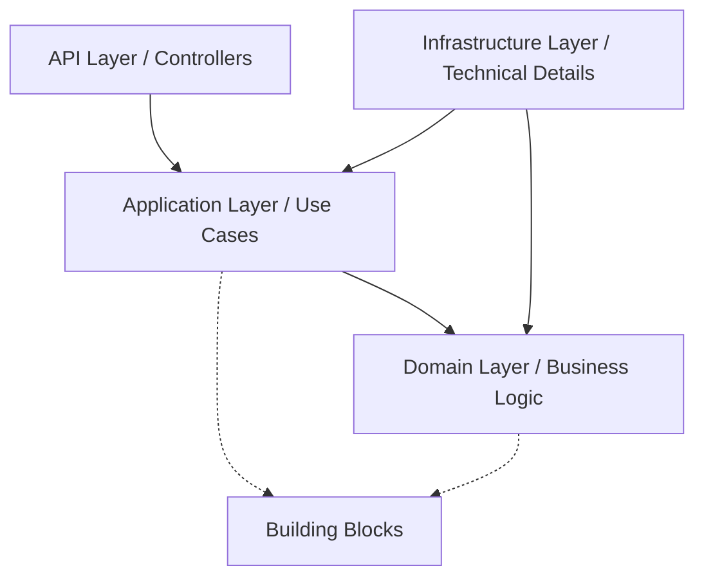

# 🚀 DEVELOPER GUIDE - BIZCORE ERP

Chào mừng bạn đến với tài liệu hướng dẫn phát triển của **Bizcore ERP**. Tài liệu này cung cấp các hướng dẫn kỹ thuật chi tiết để bạn có thể phát triển tính năng mới hoặc tạo một microservice mới một cách nhất quán và hiệu quả.

---

## 📖 MỤC LỤC

1. [Tổng quan kiến trúc (DDD-Lite)](#1-tổng-quan-kiến-trúc-ddd-lite)
2. [Cấu trúc Project](#2-cấu-trúc-project)
3. [Quy trình phát triển tính năng mới](#3-quy-trình-phát-triển-tính-năng-mới)
4. [Các Pattern cốt lõi & Building Blocks](#4-các-pattern-cốt-lõi--building-blocks)
    - [4.5. Giao tiếp gRPC (Synchronous Communication)](#45-giao-tiếp-grpc-synchronous-communication)
5. [Điều phối Saga (Orchestration)](#5-điều-phối-saga-orchestration)
6. [Hướng dẫn riêng cho từng Service](#6-hướng-dẫn-riêng-cho-từng-service)
7. [Đa ngôn ngữ & Quản trị Lỗi (Localization)](#7-đa-ngôn-ngữ--quản-trị-lỗi-localization)
8. [Checklist tạo Service mới](#8-checklist-tạo-service-mới)

---

## 1. 🏗️ Tổng quan kiến trúc (DDD-Lite)

Hệ thống Bizcore ERP áp dụng mô hình **DDD-Lite (Clean Architecture)** với 4 lớp chính để đảm bảo tính tách biệt (Separation of Concerns) và khả năng kiểm thử.

**Đặc điểm nổi bật:**
- **Transactional Inbox**: Mọi Consumer mặc định được bọc trong DB Transaction bởi hạ tầng (MassTransit). Đảm bảo tính nguyên tử (Atomicity) giữa xử lý tin nhắn và lưu database.
- **Audit Hash Chain**: Sử dụng SHA-256 để đảm bảo tính bất biến của nhật ký kiểm toán.



- **Domain Layer**: Trái tim của hệ thống, chứa thực thể (Entities), Logic nghiệp vụ thuần túy, và Exceptions. Không phụ thuộc vào bất kỳ framework nào.
- **Application Layer**: Điều phối luồng xử lý (Orchestration). Chứa Command/Query Handlers, Consumers, và DTOs.
- **Infrastructure Layer**: Triển khai chi tiết kỹ thuật (Database, External Clients, Migrations).
- **API Layer**: Cổng giao tiếp HTTP (REST endpoints), cấu hình DI, và Middleware.

---

## 2. 📁 Cấu trúc Project

Mỗi Microservice (ví dụ: `Invoice.API`) phải tuân thủ cấu trúc thư mục sau:

```text
Invoice.API/
├── Domain/
│   ├── Entities/       # Invoice.cs, Item.cs
│   ├── Enums/          # InvoiceStatus.cs
│   └── Exceptions/     # InvoiceDomainException.cs
├── Application/
│   ├── Commands/       # CreateInvoiceCommand.cs, Handlers
│   ├── Queries/        # GetInvoiceQuery.cs, Handlers
│   ├── Consumers/      # Event consumers từ MassTransit
│   ├── DTOs/           # Request/Response models
│   └── Validators/     # FluentValidation rules
├── Infrastructure/
│   ├── Data/           # AppDbContext, UnitOfWork
│   ├── Migrations/     # EF Core migrations
│   └── Clients/        # External service implementations
└── Controllers/        # InvoicesController.cs
```

---

## 3. 🛠️ Quy trình phát triển tính năng mới

Giả sử bạn cần thêm tính năng "Tạo Hóa đơn mới" vào `Invoice.API`:

### Bước 1: Định nghĩa Domain Entity

Tạo entity trong `Domain/Entities/`. 
- **Bắt buộc**: Kế thừa từ `BaseEntity` để có sẵn `Id`, `CreatedAt`, `UpdatedAt` và `RowVersion`.
- Sử dụng **Factory Method** thay vì public constructor để đảm bảo tính toàn vẹn.

```csharp
public class Invoice : BaseEntity
{
    public string CustomerName { get; private set; } = string.Empty;
    public decimal Amount { get; private set; }
    public InvoiceStatus Status { get; private set; }

    public static Invoice Create(string customerName, decimal amount)
    {
        if (amount <= 0) 
            throw new DomainException(ErrorCodes.Invoice.InvalidAmount, "Số tiền phải lớn hơn 0");

        return new Invoice 
        { 
            CustomerName = customerName,
            Amount = amount, 
            Status = InvoiceStatus.Pending 
        };
    }
}
```

### ⚠️ Lưu ý cực kỳ quan trọng về Transaction (Dành cho Consumer/Handler)

Hệ thống đã cấu hình **Transactional Inbox** (MassTransit) và **Transaction Behavior** (MediatR) tại tầng hạ tầng.

- **QUY TẮC VÀNG**: Tuyệt đối **KHÔNG** gọi `_unitOfWork.BeginTransactionAsync()` hoặc `_db.Database.BeginTransactionAsync()` bên trong hàm `Consume` hoặc `Handle`. 
- **Lý do**: Hạ tầng đã mở sẵn một transaction trước khi gọi vào logic của bạn. Việc mở thêm transaction lồng nhau sẽ gây lỗi `InvalidOperationException`.
- **Cách làm đúng**: Chỉ thực hiện thay đổi dữ liệu và gọi `await _unitOfWork.SaveChangesAsync()`. Hệ thống sẽ tự động Commit hoặc Rollback sau khi logic của bạn kết thúc.

### Bước 2: Tạo Command & Handler

Tạo Command (DTO) và Handler trong `Application/Commands/`.

> [!IMPORTANT]
> **Quy tắc Unit of Work**: Handler KHÔNG gọi `SaveChangesAsync()`. Việc này được `TransactionBehavior` tự động xử lý thông qua `IUnitOfWork` sau khi Handler hoàn tất thành công.

```csharp
public record CreateInvoiceCommand(string CustomerName, decimal Amount) : IRequest<InvoiceDto>;

public class CreateInvoiceCommandHandler : IRequestHandler<CreateInvoiceCommand, InvoiceDto>
{
    private readonly AppDbContext _context;
    private readonly IPublishEndpoint _publishEndpoint;

    public async Task<InvoiceDto> Handle(CreateInvoiceCommand request, CancellationToken ct)
    {
        var invoice = Invoice.Create(request.CustomerName, request.Amount);
        _context.Invoices.Add(invoice);

        // Publish event (MassTransit Outbox sẽ đảm bảo tính atomic)
        await _publishEndpoint.Publish<IInvoiceCreatedEvent>(new { invoice.Id, invoice.Amount });

        return invoice.ToDto();
    }
}
```

### Bước 3: Cấu hình DB & Migrations

Để thêm bảng mới hoặc thay đổi schema, hãy thực hiện theo 3 bước nhỏ:

**3.1. Tạo file Configuration (Fluent API):**
Tạo file `{EntityName}Configuration.cs` trong thư mục `Infrastructure/Data/Configurations/`. Tránh dùng Data Annotations trực tiếp trên Entity để giữ Domain "sạch".

```csharp
public class InvoiceConfiguration : IEntityTypeConfiguration<Invoice>
{
    public void Configure(EntityTypeBuilder<Invoice> builder)
    {
        builder.HasKey(i => i.Id);
        builder.Property(i => i.CustomerName).HasMaxLength(256).IsRequired();
        builder.Property(i => i.Amount).HasPrecision(18, 2);
        // RowVersion (concurrency) đã được xử lý tự động nếu dùng BaseEntityConfiguration
    }
}
```

**3.2. Đăng ký DbSet:**
Thêm thuộc tính `DbSet<T>` vào `AppDbContext.cs` của Microservice đó để có thể truy vấn dữ liệu.

```csharp
public DbSet<Invoice> Invoices { get; set; }
```

**3.3. Tạo và thực thi Migration:**
Mở terminal tại thư mục gốc của dự án và chạy các lệnh sau (thay thế đường dẫn tương ứng với service bạn đang làm):

```powershell
# 1. Tạo file migration (File sẽ nằm trong Infrastructure/Data/Migrations)
dotnet ef migrations add AddInvoiceTable --project src/Services/Invoice/Invoice.API --startup-project src/Services/Invoice/Invoice.API

# 2. Cập nhật vào Database (Local)
dotnet ef database update --project src/Services/Invoice/Invoice.API --startup-project src/Services/Invoice/Invoice.API
```

> [!TIP]
> Nếu bạn gặp lỗi không tìm thấy lệnh `dotnet ef`, hãy cài đặt tool bằng lệnh: 
> `dotnet tool install --global dotnet-ef`

### Bước 4: Viết Controller

Exposure endpoint trong `Controllers/`.

```csharp
[HttpPost]
public async Task<ActionResult<InvoiceDto>> Create([FromBody] CreateInvoiceCommand command)
{
    var result = await _mediator.Send(command);
    return Ok(result);
}
```

---

## 4. 🧩 Các Pattern cốt lõi & Building Blocks

### 4.1. Quản lý Giao dịch (Transaction & IUnitOfWork)

Hệ thống sử dụng `TransactionBehavior` để tự động bao bọc các `Command` (implement `ITransactionalCommand` hoặc kết thúc bằng từ "Command") trong một Transaction.

- **Quy tắc**: Lớp Application chỉ inject `IUnitOfWork` nếu cần điều khiển transaction thủ công (hiếm khi). Mặc định hãy để Pipeline lo.
- **Thực thi**: Pipeline sẽ gọi `UnitOfWork.SaveChangesAsync()` sau khi Handler chạy xong. Mọi thay đổi trên DbContext sẽ được commit nguyên tử (Atomic).
- **Optimistic Concurrency**: Nhờ `BaseEntity`, EF Core sẽ tự động kiểm tra `RowVersion`. Nếu có xung đột dữ liệu, hệ thống sẽ ném `DbUpdateConcurrencyException`.

### 4.2. Cấu hình DbContext (Modular Configurations)

Để tránh "God DbContext", chúng ta không viết cấu hình Fluent API trong `OnModelCreating`.

- **Quy tắc**: Mỗi Entity có một class configuration riêng trong `Infrastructure/Data/Configurations/`.
- **Cách dùng**:
    ```csharp
    protected override void OnModelCreating(ModelBuilder modelBuilder)
    {
        base.OnModelCreating(modelBuilder);
        modelBuilder.ApplyConfigurationsFromAssembly(typeof(AppDbContext).Assembly);
    }
    ```

### 4.2. Messaging & Outbox Pattern

Chúng ta sử dụng **MassTransit** với **RabbitMQ**. Để đảm bảo tính nhất quán giữa Database và Message, Outbox Pattern được kích hoạt mặc định.

- Khi bạn gọi `_publishEndpoint.Publish`, message sẽ được lưu vào bảng `OutboxMessages` trong cùng transaction với dữ liệu nghiệp vụ.
- Một background worker sẽ quét và gửi message đi thực tế.

### 4.3. Xác thực & Phân quyền động (Auth & Dynamic AuthZ)

Hệ thống sử dụng mô hình **Centralized Identity + Distributed Authorization** dựa trên mã quyền (Permission Codes).

- **Authentication**: Thực hiện qua JWT Token do `Identity.API` cấp. Token chứa các claims `permission`.
- **Authorization**: Sử dụng hằng số từ `Bizcore.BuildingBlocks.Permissions`.
- **Attribute**: Sử dụng `[RequirePermission(Permissions.Invoice.Create)]` trên Controller action.
- **Cơ chế**: Hệ thống dùng `DynamicAuthorizationPolicyProvider` để tự động tạo Policy và `PermissionAuthorizationHandler` để kiểm tra quyền từ **Redis Cache** (ưu tiên) hoặc **JWT Claims** (fallback).

#### 🛠️ Cách thêm Role & Permission mới

1. **Định nghĩa**: Thêm hằng số mã quyền vào `Bizcore.BuildingBlocks.Permissions`.
2. **Seeder**: Khai báo quyền mới trong `DbSeeder.cs` của `Identity.API`.
3. **Gán quyền**: Gán quyền cho Role qua UI quản trị hoặc API `/api/v1/roles/{id}/permissions`.

#### 🔍 Hướng dẫn Debug

- **JWT**: Dùng [jwt.io](https://jwt.io) kiểm tra claim `permission`.
- **Redis**: Kiểm tra key `user_permissions:{userId}` bằng Redis Insight.
- **Log**: Bật log `Debug` cho namespace `Bizcore.BuildingBlocks.Authorization` để xem chi tiết quá trình đánh giá quyền.

### 4.4. Audit & Reversal (Khôi phục dữ liệu)

Hệ thống cho phép khôi phục giá trị cũ của các trường thông qua `RestoreInvoiceFieldCommand`.

- **Domain Guard**: Phải kiểm tra logic nghiệp vụ trong Entity trước khi khôi phục (ví dụ: không cho phép khôi phục nếu hóa đơn đã bị hủy).
- **Concurrency**: Luôn sử dụng `RowVersion` (Timestamp) để tránh ghi đè dữ liệu cũ.

---

### 4.5. Logging & Bảo mật dữ liệu (Logging & Data Privacy)

Hệ thống sử dụng Serilog + Loki để giám sát tập trung. Mọi nhà phát triển phải tuân thủ các quy tắc sau:

1. **Infra Standardization**: Luôn sử dụng `builder.AddServiceDefaults()` để tự động cấu hình Logging, Telemetry và Health Checks.
2. **Structured Event Logging**: Đối với các sự kiện nghiệp vụ quan trọng (ví dụ: tạo hóa đơn, đăng nhập), **bắt buộc** dùng log có cấu trúc để phục vụ dashboard và alert.
   - ✅ `_logger.LogInformation("InvoiceCreated {@InvoiceEvent}", new { Id = id, Amount = val });`
3. **Data Classification**: Tuyệt đối không log dữ liệu nhạy cảm ở dạng thô. Sử dụng attribute `[SensitiveData]` với level phù hợp:
   - `Sensitive`: Sẽ được mask thành `***` (VD: Email, Phone).
   - `Restricted`: Sẽ hoàn toàn bị loại bỏ khỏi log (VD: Password, Secret).

---

### 4.6. Module Pattern & Clean Program.cs

Để giữ cho `Program.cs` sạch và dễ bảo trì, chúng ta đóng gói logic đăng ký dịch vụ vào một lớp `Module` kế thừa từ `IServiceModule`.

**Quy trình đăng ký:**

1. Tạo lớp `MyServiceModule.cs` trong project API.
2. Triển khai phương thức `RegisterServices`.
3. Sử dụng `builder.Services.AddBizcoreModule<MyServiceModule>(builder)` trong `Program.cs`.

**Ví dụ Program.cs chuẩn:**

```csharp
var builder = WebApplication.CreateBuilder(args);

// 1. Host Extensions
builder.Host.AddBizcoreLogging("My.API");

// 2. Service Registrations (Centralized)
builder.Services.AddBizcoreTelemetry("My.API");
builder.Services.AddBizcoreInfrastructure();
builder.Services.AddBizcoreAuth(builder.Configuration);
builder.Services.AddBizcoreVersioning();
builder.Services.AddBizcoreSwagger("My API", "Description");

// 3. Load Module nghiệp vụ
builder.Services.AddBizcoreModule<MyServiceModule>(builder);

var app = builder.Build();
app.UseBizcorePipeline("My API v1");
app.Run();
```

---

### 4.7. Giao tiếp gRPC (Synchronous Communication)

Hệ thống sử dụng **gRPC** cho các truy vấn dữ liệu tức thời (Query/Read-only) giữa các microservices để đảm bảo hiệu năng cao và kiểu dữ liệu chặt chẽ.

**Các quy tắc bắt buộc:**

1. **Query-only**: Chỉ dùng gRPC để đọc dữ liệu. **KHÔNG** dùng gRPC để thực hiện lệnh (Command) làm thay đổi trạng thái (hãy dùng RabbitMQ).
2. **Resilience Pipeline**: Mỗi gRPC client khi đăng ký phải được gắn Resilience Pipeline (Retry, Circuit Breaker, Timeout). Sử dụng tiện ích `AddBizcoreGrpcClient` trong `BuildingBlocks`.
3. **Service Abstraction**: Tuyệt đối không inject trực tiếp `GrpcClient` vào Business Service. Hãy bọc nó qua một Proxy Service (ví dụ: `AuditClientService`).
4. **Error Mapping**: Sử dụng `GrpcErrorMapper` để chuyển đổi `RpcException` thành Domain Exception.
5. **Query vs Command**: Chỉ dùng gRPC cho Query. Mọi Command thay đổi dữ liệu phải đi qua RabbitMQ (Async).
6. **Quy tắc 2-Hops**: Một yêu cầu đồng bộ không được vượt quá 2 bước nhảy gRPC. Nếu chuỗi dài hơn, hãy sử dụng Cache hoặc Async Events.

**Cách đăng ký gRPC Client trong Module.cs:**

```csharp
services.AddBizcoreGrpcClient<AuditGrpc.AuditGrpcClient>(
    builder.Configuration,
    "Audit" // Phải khớp với key trong appsettings.json
);
```

> 🔍 Xem chi tiết tại: [Hướng dẫn gRPC](../06-communication/GRPC_GUIDE.md)

---

## 5. 🔄 Điều phối Saga (Orchestration)

Khi một quy trình nghiệp vụ kéo dài qua nhiều service (ví dụ: Thanh toán -> Duyệt hóa đơn -> Trừ tiền -> Gửi Email), chúng ta sử dụng **Orchestration.API** với **MassTransit State Machine Saga**.

### Khi nào cần cập nhật Orchestration.API?

Bạn cần can thiệp vào đây khi:

- Thêm một bước mới vào quy trình (ví dụ: thêm bước "Gửi Email thông báo").
- Thay đổi thứ tự các bước.
- Thêm logic xử lý lỗi/bồi hoàn (Compensating Transactions).

### Quy trình thêm một bước mới (ví dụ: Gửi Email sau khi thanh toán)

1. **Định nghĩa Event/Command**: Trong `BuildingBlocks.Contracts`, thêm interface cho Command mới (ví dụ: `ISendEmailCommand`) và Event kết thúc (ví dụ: `IEmailSentEvent`).
2. **Khai báo trong Saga**: Mở `PaymentSaga.cs`, khai báo Event và State mới (nếu cần).

    ```csharp
    public Event<IEmailSentEvent> EmailSent { get; private set; }
    public State SendingEmail { get; private set; }
    ```

3. **Cập nhật State Machine**: Thay vì `Finalize()` ngay sau khi `PaymentConfirmed`, bạn chuyển sang state mới và gửi command.

    ```csharp
    During(Confirmed,
        When(PaymentConfirmed)
            .SendAsync(new Uri("queue:notification-service"), ctx => ctx.Init<ISendEmailCommand>(new { ... }))
            .TransitionTo(SendingEmail)
    );

    During(SendingEmail,
        When(EmailSent)
            .Finalize()
    );
    ```

4. **Xử lý Timeout**: Luôn thêm `Schedule` để tránh Saga bị treo nếu service bên thứ 3 (Email) không phản hồi.

### Cách tạo một Luồng điều phối (Saga) hoàn toàn mới

Nếu bạn có một quy trình mới (ví dụ: Quy trình Nhập kho - `InventorySaga`), hãy thực hiện các bước sau:

1. **Tạo State Entity**: Tạo file `InventorySagaState.cs` trong `Domain/Entities/`. Class này phải implement `SagaStateMachineInstance`.
2. **Tạo State Machine**: Tạo file `InventorySaga.cs` trong `Application/Sagas/` kế thừa `MassTransitStateMachine<InventorySagaState>`.
3. **Cập nhật AppDbContext**:
    - Thêm `DbSet<InventorySagaState>`.
    - Cấu hình mapping trong `OnModelCreating` (đặc biệt là `CorrelationId`).
4. **Đăng ký trong `Program.cs`**:
    - Thêm vào phần `AddMassTransit`:

        ```csharp
        x.AddSagaStateMachine<InventorySaga, InventorySagaState>()
            .EntityFrameworkRepository(r => { ... });
        ```

    - Cấu hình Receive Endpoint:

        ```csharp
        cfg.ReceiveEndpoint("orchestration-inventory-saga", e =>
        {
            e.ConfigureSaga<InventorySagaState>(context);
        });
        ```

---

## 6. 💡 Hướng dẫn riêng cho từng Service

- **Identity.API**: Quản lý User, Role, Permission. Khi thêm quyền mới, hãy cập nhật class `Permissions` trong `BuildingBlocks`.
- **Invoice.API**: Core xử lý tài chính. Cần cực kỳ cẩn thận với logic tính toán và trạng thái. Tránh side-effect không cần thiết, chỉ tập trung vào dữ liệu Invoice.
- **Payment.API**: Tích hợp cổng thanh toán. Luôn xử lý Idempotency.
- **Orchestration.API**: "Tổng đạo diễn" của quy trình. Không chứa logic nghiệp vụ nặng, chỉ điều phối flow bằng cách nhận Event và gửi Command.
- **Report.API**: Sử dụng mô hình Read-only. Thường consume events để update materialised views. Thích hợp cho các task "Gửi Email" hoặc "Cập nhật kế toán" nếu các task này không ảnh hưởng đến tính toàn vẹn của transaction chính.

---

## 7. 🌍 Đa ngôn ngữ & Quản trị Lỗi (Localization)

Hệ thống sử dụng cơ chế Localization tập trung để đảm bảo tính quốc tế hóa.

### 7.1. Cách sử dụng Error Codes (Backend)

Khi xảy ra lỗi nghiệp vụ, đừng trả về text. Hãy dùng `ErrorCodes`:

1.  Kiểm tra xem mã lỗi đã có trong `Bizcore.BuildingBlocks.ErrorCodes` chưa. Nếu chưa, hãy thêm vào.
2.  Ném exception kèm mã lỗi:

    ```csharp
    throw new DomainException(ErrorCodes.Invoice.NotFound, "Invoice not found", new { id });
    ```

### 7.2. Cách thêm bản dịch mới (Frontend)

1.  Mở thư mục `src/WebUI/public/locales/`.
2.  Thêm key vào file JSON tương ứng (ví dụ `vi/errors.json` và `en/errors.json`).
3.  Sử dụng trong component:

    ```javascript
    const { t } = useTranslation("invoice");
    return <h1>{t("title")}</h1>;
    ```

### 7.3. Lan truyền ngôn ngữ trong MassTransit

Hệ thống tự động đồng bộ `CultureInfo` qua RabbitMQ. Bạn không cần làm gì thêm, chỉ cần sử dụng `DateTime.Now.ToString()` hoặc các hàm định dạng khác, nó sẽ tự động theo ngôn ngữ của người gửi message.

---

## 8. ✅ Checklist tạo Service mới

1. [ ] Tạo project ASP.NET Core Web API mới.
2. [ ] Reference project `Bizcore.BuildingBlocks`.
3. [ ] Tạo lớp `ServiceModule` và implement `IServiceModule`.
4. [ ] Di chuyển logic đăng ký DB, DI, MassTransit vào `Module`.
5. [ ] Làm sạch `Program.cs` theo template chuẩn (Sử dụng `AddServiceDefaults`).
6. [ ] Kiểm tra và gắn attribute `[SensitiveData]` cho các trường PII trong DTO.
7. [ ] Thêm cấu hình logging, RabbitMQ, Redis vào `appsettings.json`.
8. [ ] Đăng ký service mới vào Gateway (YARP) `appsettings.json`.
9. [ ] Thêm service vào `docker-compose.yml`.
10. [ ] Định nghĩa các Permission mới trong `BuildingBlocks` và Seeder.

---

> **Tài liệu liên quan**:
>
> - [Coding Conventions](../06-conventions/CODING_CONVENTIONS.md)
> - [Orchestration Guide](../03-architecture/ORCHESTRATION_GUIDE.md)
> - [gRPC Guide](../06-communication/GRPC_GUIDE.md)

