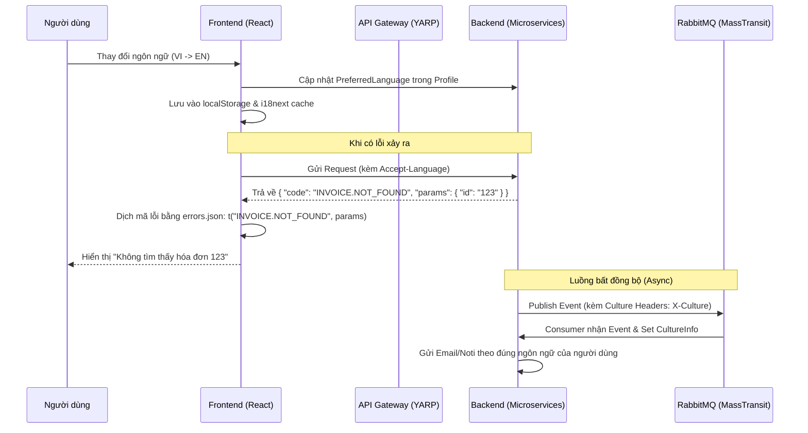

# Hướng dẫn Đa ngôn ngữ & Quản trị Lỗi (Localization & Error Governance)

Tài liệu này mô tả kiến trúc hỗ trợ đa ngôn ngữ và cơ chế xử lý lỗi chuẩn enterprise trong hệ thống **Bizcore ERP**.

## 1. Nguyên tắc cốt lõi (Core Principles)

- **Frontend-First Localization**: Các chuỗi UI và thông báo lỗi được dịch tại Frontend.
- **Stable Error Codes**: Backend trả về mã lỗi ổn định (máy có thể đọc được), ví dụ: `USER.NOT_FOUND`.
- **Culture Propagation**: Ngôn ngữ ưu tiên của người dùng được lan truyền xuyên suốt các microservices, bao gồm cả các hàng đợi tin nhắn bất đồng bộ (MassTransit).
- **Invariant Observability**: Logs, metrics và traces luôn giữ bằng tiếng Anh (Invariant Culture) để đảm bảo tính nhất quán khi tìm kiếm và giám sát.

## 2. Luồng hoạt động (Workflow)



---

## 3. Hướng dẫn chi tiết Backend

### Khai báo Mã lỗi (Error Codes)
Tất cả mã lỗi được định nghĩa tập trung tại `Bizcore.BuildingBlocks.ErrorCodes`.

```csharp
public static class User
{
    public const string NotFound = "USER.NOT_FOUND";
}
```

### Sử dụng Exception
Ném lỗi kèm theo mã lỗi và tham số (nếu có):

```csharp
throw new NotFoundException(ErrorCodes.User.NotFound, "User not found", new { userId });
```

### Cấu trúc phản hồi chuẩn (Standardized Response)
`GlobalExceptionMiddleware` đảm bảo mọi phản hồi lỗi đều tuân thủ cấu trúc:

```json
{
  "code": "USER.NOT_FOUND",
  "message": "Technical debug message (English)",
  "params": { "userId": "..." },
  "traceId": "...",
  "timestamp": "..."
}
```

### Lan truyền ngôn ngữ (Culture Propagation)
Sử dụng `CulturePublishFilter` và `CultureConsumeFilter` trong MassTransit để tự động đồng bộ `CultureInfo.CurrentCulture` giữa các dịch vụ.

---

## 4. Hướng dẫn chi tiết Frontend

### Cấu hình i18next
Sử dụng lazy loading cho các namespace:
- `common.json`: Các nhãn UI, nút bấm, menu.
- `errors.json`: Bản đồ ánh xạ mã lỗi từ Backend sang ngôn ngữ hiển thị.
- `invoice.json`, `payment.json`: Các chuỗi đặc thù cho từng module.

### Dịch thông báo lỗi
Sử dụng helper `getErrorDetail` hoặc Axios Interceptor:

```javascript
const message = t(`errors:${data.code}`, data.params);
```

---

## 5. Thiết kế Dịch dữ liệu động (Dynamic Data Translation)

Đối với các nội dung thay đổi trong Database (như tên sản phẩm, danh mục), sử dụng mô hình bảng dịch:

**Bảng: Products**
| Id | SKU | Price |
|----|-----|-------|
| 1  | IP15| 999   |

**Bảng: ProductTranslations**
| Id | ProductId | Culture | FieldName | Value |
|----|-----------|---------|-----------|-------|
| 101| 1         | en-US   | Name      | iPhone 15 |
| 102| 1         | vi-VN   | Name      | iPhone 15 Pro |

Mô hình này giúp thêm ngôn ngữ mới mà không cần thay đổi cấu trúc bảng chính.
