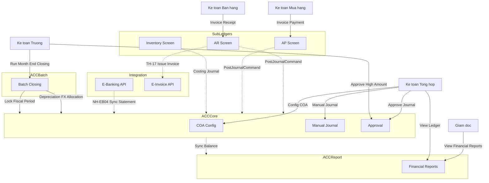

# BIZCORE ERP: ACC SERVICE DESIGN - ENTERPRISE ACCOUNTING ENGINE (V3)

## 1. Tầm nhìn Kiến trúc (Architectural Vision)

ACC Service được thiết kế theo tiêu chuẩn của một **Core Accounting Engine** Enterprise-grade (tương tự triết lý của SAP FI/CO, Oracle Financials, Dynamics 365).

Nó bóc tách hoàn toàn khỏi các nghiệp vụ kinh doanh (Sub-ledgers) và chỉ tập trung vào: **Ledger, Auto-Posting, Account Balance, Period Close, và Reporting.**

### 1.1 Phân mảnh Bounded Contexts

Hệ thống ERP chia thành các Microservices:

| Service | Trách nhiệm |
|---------|-------------|
| **Admin Service** | **(Mới)** Quản lý Master Data toàn doanh nghiệp (`LegalEntity`, `Branch`, `Department`, `User`, `Role`). Đóng vai trò Source of Truth cho cấu trúc công ty. |
| **ACC Core** | Nhận posting realtime từ sub-ledgers qua MQ. Ledger, Journal Entry, Fiscal Year, COA, Rule Engine. |
| **ACC Batch** | **Service độc lập** chạy Batch Orchestrator (EOD, Revaluation, Depreciation, Costing, Closing). |
| **Integration** | **(Mới)** Anti-Corruption Layer (ACL) kết nối API bên thứ 3 (Ngân hàng, HĐĐT). |
| **ACC Report**| Materialized Views, CQRS, Daily Balance, YTD Balance. |
| **AP/AR/INV** | Các Sub-ledgers quản lý Invoices, Receipts, Inventory Costing, Settlement. |

### 1.2 Decoupling Master Data & Multi-Tenancy

- **Không lưu trữ Master Data Tổ chức**: ACC Service **không** sở hữu hay quản lý bảng `LegalEntity`, `Branch` hay `Department`. Nó chỉ lưu các trường ID (ví dụ `LegalEntityId`) làm Foreign Key (mềm) trỏ về Admin Service. Điều này tránh cho ACC trở thành "God Service".
- Bắt buộc chứa `LegalEntityId` và `BranchId` trên toàn bộ transaction tables của Kế toán.
- Hỗ trợ **Intercompany Accounting** (Giao dịch liên công ty): Các giao dịch qua lại giữa 2 LegalEntity sẽ tự sinh cặp bút toán `Due To / Due From` và lưu Elimination entries phục vụ Consolidation.

---

## 2. Hệ thống Tài khoản & Không gian chiều (COA & Dimensions)

### 2.1 Enterprise Chart of Accounts (COA)

`AccountChart` được mở rộng để chứa các Control Behaviors, Normal Balance và Hierarchy.

```sql
AccountChart (
    Id UNIQUEIDENTIFIER PK,
    LegalEntityId UNIQUEIDENTIFIER NOT NULL,
    AccountCode NVARCHAR(20) NOT NULL UNIQUE,
    AccountName NVARCHAR(255) NOT NULL,
    ShortName NVARCHAR(100),

    ParentAccountId UNIQUEIDENTIFIER NULL FK,
    LevelNo INT NOT NULL,
    AccountPath NVARCHAR(500),

    AccountType INT NOT NULL,         -- Asset, Liability, Equity, Revenue, Expense
    AccountCategory INT NULL,         -- Cash, Bank, AR, AP, Tax...

    NormalBalance CHAR(1) NOT NULL,   -- 'D' (Debit) hoặc 'C' (Credit)

    IsPostingAccount BIT NOT NULL,    -- True = Node lá, False = Parent node (không cho post)
    AllowManualPosting BIT NOT NULL,  -- Cho phép Kế toán viên nhập tay
    AllowSystemPosting BIT NOT NULL,  -- Cho phép Rule Engine post tự động

    OpenItemManaged BIT NOT NULL,     -- Yêu cầu đối trừ (AR/AP, Tạm ứng)
    RequireReconciliation BIT NOT NULL, -- Yêu cầu đối soát (Ngân hàng)

    IsForeignCurrency BIT NOT NULL,
    DefaultCurrencyCode NVARCHAR(3),

    -- Require Dimensions (Quy định data quality)
    RequirePartner BIT NOT NULL,
    RequireCostCenter BIT NOT NULL,
    RequireDepartment BIT NOT NULL,
    RequireProject BIT NOT NULL,

    -- Reporting & Consolidation
    FinancialStatementGroup NVARCHAR(50),
    CashFlowGroup NVARCHAR(50),
    GroupAccountCode NVARCHAR(20),    -- Map lên Group COA

    -- Versioning
    EffectiveFrom DATE NOT NULL,
    EffectiveTo DATE NULL,
    IsLocked BIT DEFAULT 0,
    LockedReason NVARCHAR(200),
    
    IsActive BIT NOT NULL
)
```

### 2.2 Account Mapping (Chuẩn mực Kế toán & Hợp nhất)

Cực kỳ quan trọng để hỗ trợ xuất báo cáo theo nhiều chuẩn mực (IFRS, VAS) hoặc Hợp nhất Báo cáo Tài chính Tập đoàn (Group Consolidation) mà không cần phải nhập đúp bút toán.

```sql
AccountMapping (
    Id UNIQUEIDENTIFIER PK,
    LegalEntityId UNIQUEIDENTIFIER NOT NULL,
    SourceAccountCode NVARCHAR(20) NOT NULL,      -- VD: TK 642 (VAS)
    TargetAccountCode NVARCHAR(20) NOT NULL,      -- VD: TK SGA Expense (IFRS)
    MappingType INT NOT NULL,                     -- 1 = LocalToGroup, 2 = VASToIFRS, 3 = InternalReporting
    ValidFrom DATE NOT NULL,
    ValidTo DATE NULL
)
```

### 2.3 Accounting Dimensions (Không gian chiều)

Hỗ trợ hạch toán phân tích đa chiều. Thay vì tạo ra hàng trăm tài khoản con (Segmented Accounting) như `642-Sales`, `642-Marketing`, hệ thống chỉ dùng 1 tài khoản `642` và gắn thêm các thẻ (Tag) gọi là Dimension.

```sql
AccountingDimension (
    Id UNIQUEIDENTIFIER PK,
    LegalEntityId UNIQUEIDENTIFIER NOT NULL,
    DimensionCode NVARCHAR(50) NOT NULL UNIQUE,   -- VD: 'COST_CENTER', 'PROJECT', 'DEPARTMENT'
    DimensionName NVARCHAR(255) NOT NULL,         -- VD: 'Trung tâm chi phí', 'Dự án', 'Phòng ban'
    IsSystem BIT NOT NULL,                        -- True: Dimension do hệ thống định nghĩa không thể xóa.
                                                  -- False: Dimension do Kế toán tự định nghĩa thêm.
    IsActive BIT NOT NULL
)

DimensionValue (
    Id UNIQUEIDENTIFIER PK,
    DimensionId UNIQUEIDENTIFIER FK NOT NULL,     -- Trỏ về Dimension cha
    ValueCode NVARCHAR(50) NOT NULL,              -- VD: 'CC-SALE-01', 'PRJ-2024-ERP'
    ValueName NVARCHAR(255) NOT NULL,             -- VD: 'Phòng Kinh doanh 1', 'Dự án triển khai ERP'
    ParentValueId UNIQUEIDENTIFIER NULL FK,       -- Hỗ trợ cấu trúc phân cấp (Hierarchy) cho báo cáo gộp
    IsActive BIT NOT NULL
)
```

**Giải thích chức năng:**
Dimension giúp trả lời các câu hỏi quản trị sâu hơn: "Chi phí này của dự án nào?", "Doanh thu này của phòng ban nào?".

#### 2.3.1 Luồng xử lý Dimensions (Dimension Data Flow)

1. **Thiết lập (Configuration)**: Kế toán trưởng vào `ACC Core UI`, tạo Dimension `COST_CENTER` (Trung tâm chi phí) và thêm các giá trị (VD: `SALE-01`, `SALE-02`).
2. **Gắn Validation vào Tài khoản**: Kế toán trưởng cấu hình tài khoản `642 - Chi phí bán hàng`, bật cờ `RequireCostCenter = True`. Từ lúc này, mọi bút toán (dù tự động hay nhập tay) chạm vào 642 đều **bắt buộc** phải có thông tin `COST_CENTER`.
3. **Phát sinh giao dịch (Sub-ledger)**: Nhân viên tạo Hóa đơn Mua hàng tại phân hệ **AP Service**. Trên giao diện AP, khi nhập dòng "Chi phí tiếp khách", hệ thống AP (sau khi call API lấy list Dimension từ ACC) sẽ bắt buộc nhân viên chọn *Trung tâm chi phí* (Ví dụ chọn `SALE-01`).
4. **Bắn Message (Message Broker)**: AP Service gửi `PostJournalCommand` qua RabbitMQ, trong đó có đính kèm mảng Dimensions: `[{ "DimensionCode": "COST_CENTER", "ValueCode": "SALE-01" }]`.
5. **Kiểm tra (Validation Engine)**: `ACC Core` nhận Message. Posting Rule Engine định khoản Nợ 642. Trước khi ghi vào Database, hệ thống Validation kiểm tra: *"Tài khoản 642 yêu cầu CostCenter, payload có gửi không? Giá trị SALE-01 có tồn tại và Active không?"*. Nếu OK -> Ghi sổ. Nếu thiếu/sai -> Từ chối ghi sổ, đẩy vào Dead Letter Queue hoặc bắn lỗi về AP.
6. **Lưu trữ & Báo cáo**: Bút toán được lưu vào `JournalLine` kèm theo bảng phụ `JournalLineDimension`. Sau này, khi xuất báo cáo, `ACC Report Service` dễ dàng nhóm (Group By) chi phí theo từng `COST_CENTER` để ra báo cáo Lãi/Lỗ theo phòng ban.

#### 2.3.2 Sub-account vs Dimension (Giải quyết bài toán phình to COA)

Một sai lầm phổ biến khi thiết kế ERP là cố gắng biến hệ thống tài khoản thành công cụ phân tích bằng cách đẻ ra hàng loạt tài khoản con (Segmented COA).

**Ví dụ bài toán:** Giám đốc muốn biết *Chi phí nhân viên (6421)* và *Chi phí vật liệu (6422)* của riêng **Phòng Marketing** và **Phòng Sales** trong **Dự án Triển lãm**.

* **Cách làm cũ (Segmented COA - Phình to tài khoản)**:
  Kế toán phải tạo ra một ma trận tài khoản: `6421-MKT-TRIENLAM`, `6421-SALES-TRIENLAM`, `6422-MKT-TRIENLAM`, `6422-SALES-TRIENLAM`... Nếu có 10 loại chi phí, 5 phòng ban, 20 dự án, hệ thống sẽ sinh ra **1.000 tài khoản con**! Sổ cái sẽ biến thành một "bãi rác" dữ liệu cực kỳ khó bảo trì.

* **Cách làm Enterprise (Dùng Dimension)**:
  Hệ thống tài khoản vẫn giữ nguyên bản chất tự nhiên (Natural Account) với số lượng tài khoản cốt lõi không đổi (6421 đến 6428). Khi hạch toán chi phí nhân viên MKT cho dự án Triển lãm, nhân viên chỉ cần định khoản vào đúng bản chất chi phí và gắn các thẻ Dimension:
  - Tài khoản: `6421` (Bản chất chi phí - WHAT)
  - Dimension `COST_CENTER`: `MKT` (Chi cho ai - WHO)
  - Dimension `PROJECT`: `TRIENLAM` (Chi ở đâu - WHERE)

**Lợi ích kiến trúc mang lại:**
1. **Sổ cái Lean (Gọn nhẹ)**: Bảng AccountChart luôn sạch sẽ và ổn định.
2. **Khả năng mở rộng vô hạn**: Khi có dự án mới, chỉ việc cấu hình thêm 1 mã vào bảng `DimensionValue` mà không cần đụng chạm gì đến cấu trúc Tài khoản.
3. **Báo cáo Pivot đa chiều**: Các thẻ (Tags) hoạt động độc lập. `ACC Report Service` có thể dễ dàng group dữ liệu để trả lời: "Tổng chi phí dự án Triển lãm là bao nhiêu?" (Bỏ qua phòng ban) hoặc "Phòng MKT tiêu tổng cộng bao nhiêu tiền?" (Bỏ qua dự án).

---

## 3. Lịch Kế toán & Quản lý Kỳ (Calendar & Fiscal Year)

Enterprise ERP bắt buộc tách rời `BusinessDate` (Ngày hạch toán hệ thống đang làm việc) và `SystemDate` (Ngày thực tế).

### 3.1 Accounting Calendar & Work Date

Dùng để quản lý "Ngày làm việc" của hệ thống Kế toán độc lập với ngày thực tế của máy chủ. Rất quan trọng trong quá trình chạy Batch EOD.

```sql
AccountingCalendar (
    LegalEntityId UNIQUEIDENTIFIER PK,          -- Mỗi công ty có một lịch riêng
    CurrentBusinessDate DATE NOT NULL,          -- Ngày hạch toán hiện tại (VD: Đang là 31/12 dù hôm nay là 05/01)
    CurrentFiscalPeriodId UNIQUEIDENTIFIER FK,  -- Trỏ tới ID của kỳ kế toán hiện tại
    DayStatus INT NOT NULL,                     -- Trạng thái ngày làm việc: 
                                                -- 1 = Open (Cho phép post giao dịch)
                                                -- 2 = Closing (Đang chạy EOD Batch, tạm ngưng post)
                                                -- 3 = Closed (Đã đóng ngày)
    LastUpdatedAt DATETIME2 NOT NULL            -- Thời gian switch sang ngày mới
)
```

### 3.2 Fiscal Year & Fiscal Period (Năm tài chính & Kỳ kế toán)

Hỗ trợ các công ty có năm tài chính đặc thù (VD: Bắt đầu từ 01/04 thay vì 01/01).

```sql
FiscalYear (
    Id UNIQUEIDENTIFIER PK,
    LegalEntityId UNIQUEIDENTIFIER NOT NULL,
    YearCode NVARCHAR(10) NOT NULL,             -- VD: 'FY2024'
    StartDate DATE NOT NULL,                    -- Ngày bắt đầu năm TC (VD: '2024-01-01')
    EndDate DATE NOT NULL,                      -- Ngày kết thúc năm TC (VD: '2024-12-31')
    Status INT NOT NULL                         -- 1 = Open (Đang mở), 2 = Closed (Đã khóa sổ năm)
)

FiscalPeriod (
    Id UNIQUEIDENTIFIER PK,
    FiscalYearId UNIQUEIDENTIFIER FK NOT NULL,
    PeriodNumber INT NOT NULL,                  -- 1 đến 12 (tháng thông thường)
                                                -- hoặc 13, 14 (Kỳ điều chỉnh/Adjustment Periods dành cho Audit)
    PeriodName NVARCHAR(50) NOT NULL,           -- VD: 'Tháng 1 - 2024' hoặc 'Kỳ điều chỉnh kiểm toán 2024'
    StartDate DATE NOT NULL,                    -- Ngày bắt đầu kỳ
    EndDate DATE NOT NULL,                      -- Ngày kết thúc kỳ
    Status INT NOT NULL                         -- Trạng thái kỳ:
                                                -- 1 = Open (Mở bình thường)
                                                -- 2 = Locked (Tạm khóa, không cho hạch toán tự động)
                                                -- 3 = Closed (Khóa vĩnh viễn sau Audit)
)
```

---

## 4. Bút toán Sổ cái (Ledger & Journal Engine)

*Sử dụng kiểu dữ liệu `DECIMAL(38,12)` để tránh sai số khi chia tỷ giá, crypto, hoặc multiple currencies.*

### 4.1 Journal Header

```sql
JournalHeader (
    Id UNIQUEIDENTIFIER PK,
    LegalEntityId UNIQUEIDENTIFIER NOT NULL,
    BranchId UNIQUEIDENTIFIER NULL,
    
    LedgerSequence BIGINT IDENTITY,               -- Số thứ tự Ledger tuyến tính tuyệt đối
    JournalNo NVARCHAR(50) NOT NULL UNIQUE,

    FiscalPeriodId UNIQUEIDENTIFIER FK NOT NULL,
    PostingDate DATE NOT NULL,                    -- Ngày hạch toán (Dựa trên BusinessDate)
    DocumentDate DATE NOT NULL,                   -- Ngày trên chứng từ gốc
    
    SourceModule NVARCHAR(50) NOT NULL,
    SourceDocumentId NVARCHAR(100) NOT NULL,
    SourceDocumentNo NVARCHAR(50) NULL,
    
    CurrencyCode NVARCHAR(3) NOT NULL,
    ExchangeRate DECIMAL(38,12) DEFAULT 1,
    
    TotalDebitAmount DECIMAL(38,12) NOT NULL,
    TotalCreditAmount DECIMAL(38,12) NOT NULL,
    
    Status INT NOT NULL,                          -- Draft, PendingApproval, Posted, Reversed
    ReversalJournalId UNIQUEIDENTIFIER NULL,      -- ID bút toán đảo
    OriginalJournalId UNIQUEIDENTIFIER NULL,      -- ID bút toán gốc bị đảo
    ReversalReason NVARCHAR(500) NULL,
    
    CreatedBy NVARCHAR(100), CreatedAt DATETIME2,
    PostedBy NVARCHAR(100), PostedAt DATETIME2
)
```

### 4.2 Journal Line (1 row = 1 leg)

```sql
JournalLine (
    Id UNIQUEIDENTIFIER PK,
    JournalHeaderId UNIQUEIDENTIFIER FK NOT NULL,
    LineNumber INT NOT NULL,
    
    AccountCode NVARCHAR(20) NOT NULL,
    EntryType CHAR(1) NOT NULL,                   -- 'D' (Debit) hoặc 'C' (Credit)
    
    Amount DECIMAL(38,12) NOT NULL,               -- Số tiền nguyên tệ
    AmountLCY DECIMAL(38,12) NOT NULL,            -- Số tiền nội tệ (Local Currency)
    
    Description NVARCHAR(500),
    
    -- Dimension Keys trực tiếp (để build Balance siêu tốc)
    PartnerId UNIQUEIDENTIFIER NULL,
    CostCenterId UNIQUEIDENTIFIER NULL,
    DepartmentId UNIQUEIDENTIFIER NULL,
    ProjectId UNIQUEIDENTIFIER NULL
)
```

### 4.3 Idempotency & Posting Log (Bảo vệ Message Queue)

Để tránh duplicate journal khi RabbitMQ retry.

```sql
PostingRequestLog (
    IdempotencyKey UNIQUEIDENTIFIER PK,
    SourceModule NVARCHAR(50),
    SourceDocumentId NVARCHAR(100),
    Status INT,                                   -- Processing, Success, Failed
    ErrorMessage NVARCHAR(MAX),
    ProcessedAt DATETIME2
)
```

---

## 5. Động cơ Quy tắc & Bút toán tự động (Rules Engine)

### 5.1 Dynamic Condition Posting Rule

Cho phép cấu hình hạch toán mềm theo điều kiện IF/ELSE (Không hardcode C#).

```sql
PostingRule (
    Id UNIQUEIDENTIFIER PK,
    LegalEntityId UNIQUEIDENTIFIER NOT NULL,
    SourceModule NVARCHAR(50),                    -- 'AR'
    TransactionType NVARCHAR(50),                 -- 'SalesInvoice'
    RuleName NVARCHAR(200),
    Priority INT,                                 -- Ưu tiên xử lý Rule nào trước
    ConditionExpression NVARCHAR(MAX),            -- VD: "CustomerGroup == 'EXPORT'"
    EffectiveFrom DATE, EffectiveTo DATE
)

PostingRuleDetail (
    Id UNIQUEIDENTIFIER PK,
    PostingRuleId UNIQUEIDENTIFIER FK,
    GroupId INT NULL,                             -- Nhóm dòng (VD: Nhóm 1 cho Tiền hàng, Nhóm 2 cho Thuế)
    LineNo INT NOT NULL,                          -- Thứ tự dòng sinh ra (1, 2, 3...)
    EntryType CHAR(1) NOT NULL,                   -- 'D' (Debit) hoặc 'C' (Credit)
    AccountFormula NVARCHAR(200) NOT NULL,        -- Tĩnh '5112' hoặc động 'ItemCategory.SalesAccount'
    AmountFormula NVARCHAR(200) NOT NULL          -- Tên biến (FormulaKey): 'SubTotal', 'TaxAmount'
)
```

### 5.2 Recurring & Accrual Engine (Bút toán định kỳ & Phân bổ)

Dùng cho Prepaid Expense (Chi phí trả trước) hoặc Accrual (Trích trước). Khác với quy tắc động, đây là các giao dịch có tính chu kỳ. ACC Batch Service (Job Scheduler) sẽ quét các bảng này hàng ngày/hàng tháng để tự động sinh `JournalHeader`.

#### RecurringJournalTemplate (Mẫu bút toán định kỳ)

Sử dụng cho các bút toán lặp lại với số tiền cố định (VD: Lương quản lý cố định, Phí dịch vụ hàng tháng).

```sql
RecurringJournalTemplate (
    Id UNIQUEIDENTIFIER PK,
    LegalEntityId UNIQUEIDENTIFIER NOT NULL,
    TemplateCode NVARCHAR(50) NOT NULL UNIQUE,    -- VD: 'RJ-RENT-01'
    TemplateName NVARCHAR(200) NOT NULL,          -- VD: 'Bút toán phân bổ tiền thuê VP'
    Frequency NVARCHAR(20) NOT NULL,              -- 'Daily', 'Weekly', 'Monthly', 'Yearly'
    DayOfMonth INT NULL,                          -- Ngày chạy trong tháng (VD: 28)
    StartDate DATE NOT NULL,                      -- Ngày bắt đầu hiệu lực
    EndDate DATE NULL,                            -- Ngày kết thúc (nếu có)
    NextRunDate DATE NOT NULL,                    -- Ngày Job Scheduler sẽ quét chạy tiếp theo
    JournalDescription NVARCHAR(500),             -- Diễn giải cho bút toán được sinh ra
    Status INT NOT NULL                           -- Active, Suspended, Completed
)

-- Chi tiết Nợ/Có của mẫu bút toán định kỳ
RecurringJournalTemplateLine (
    Id UNIQUEIDENTIFIER PK,
    TemplateId UNIQUEIDENTIFIER FK NOT NULL,
    LineNumber INT NOT NULL,
    AccountCode NVARCHAR(20) NOT NULL,            -- TK hạch toán (VD: 6422, 242)
    EntryType CHAR(1) NOT NULL,                   -- 'D' (Debit) hoặc 'C' (Credit)
    Amount DECIMAL(38,12) NOT NULL,               -- Số tiền định kỳ
    CurrencyCode NVARCHAR(3) DEFAULT 'VND',
    CostCenterId UNIQUEIDENTIFIER NULL            -- Phân bổ theo Dimension
)
```

#### DeferredExpenseSchedule (Lịch phân bổ chi phí/doanh thu trả trước)

Sử dụng cho hệ thống Accrual/Deferral. VD: Trả trước tiền thuê nhà 120 triệu cho 12 tháng. Khi hạch toán hóa đơn gốc (Ghi Nợ 242), hệ thống sẽ tự động sinh một `DeferredExpenseSchedule`. Hàng tháng ACC Batch Service sẽ tạo bút toán khấu trừ dần.

```sql
DeferredExpenseSchedule (
    Id UNIQUEIDENTIFIER PK,
    LegalEntityId UNIQUEIDENTIFIER NOT NULL,
    SourceJournalId UNIQUEIDENTIFIER FK NOT NULL, -- ID Bút toán gốc trả tiền (Nợ 242 / Có 111)
    
    DeferredAccountCode NVARCHAR(20) NOT NULL,    -- TK Chờ phân bổ (VD: 242 - Chi phí trả trước)
    AllocationAccountCode NVARCHAR(20) NOT NULL,  -- TK Chi phí thực tế đích (VD: 6422 - Chi phí QLDN)
    
    TotalAmount DECIMAL(38,12) NOT NULL,          -- Tổng số tiền cần phân bổ (VD: 120,000,000)
    TotalMonths INT NOT NULL,                     -- Tổng số kỳ (VD: 12)
    MonthlyAmount DECIMAL(38,12) NOT NULL,        -- Số tiền phân bổ mỗi kỳ (VD: 10,000,000)
    RemainingAmount DECIMAL(38,12) NOT NULL,      -- Số tiền còn lại chưa phân bổ
    
    StartDate DATE NOT NULL,                      -- Tháng bắt đầu trích
    LastRunDate DATE NULL,                        -- Lần cuối Job phân bổ thành công
    
    Status INT NOT NULL                           -- InProgress, Completed, Cancelled
)
```

---

## 6. Enterprise Materialized Balances & Snapshot

### 6.1 Daily & Dimension Materialized Balance

Không update realtime, mà update qua Background Worker (Eventual Consistency) nhưng bắt buộc tính toán tới level Dimension, Daily và YTD để Report không bị crash.

```sql
AccountBalance (
    LegalEntityId UNIQUEIDENTIFIER,
    BranchId UNIQUEIDENTIFIER,

    FiscalYearId UNIQUEIDENTIFIER,
    FiscalPeriodId UNIQUEIDENTIFIER,
    BalanceDate DATE,                             -- Daily Balance

    AccountCode NVARCHAR(20),
    CurrencyCode NVARCHAR(3),

    -- Dimensions breakdown
    CostCenterId UNIQUEIDENTIFIER,
    DepartmentId UNIQUEIDENTIFIER,
    ProjectId UNIQUEIDENTIFIER,
    PartnerId UNIQUEIDENTIFIER,

    OpeningBalance DECIMAL(38,12),
    DebitMovement DECIMAL(38,12),
    CreditMovement DECIMAL(38,12),
    ClosingBalance DECIMAL(38,12),

    OpeningBalanceLCY DECIMAL(38,12),
    DebitMovementLCY DECIMAL(38,12),
    CreditMovementLCY DECIMAL(38,12),
    ClosingBalanceLCY DECIMAL(38,12),

    YTDDebit DECIMAL(38,12),                      -- Lũy kế Nợ đầu năm (Year-To-Date)
    YTDCredit DECIMAL(38,12),
    YTDDebitLCY DECIMAL(38,12),
    YTDCreditLCY DECIMAL(38,12),

    LastJournalSequence BIGINT,                   -- Tới sequence nào rồi? (Phục vụ rebuild)
    LastUpdatedAt DATETIME2,

    PRIMARY KEY (LegalEntityId, BranchId, FiscalPeriodId, BalanceDate, AccountCode, CurrencyCode, CostCenterId, DepartmentId, ProjectId, PartnerId)
)
```

### 6.2 Period Snapshot (Freeze)

Khi Khóa sổ (Closing), toàn bộ Trial Balance và Financial Statement lines tại thời điểm đó được snapshot ra bảng `PeriodBalanceSnapshot` (Immutable). Dù tương lai có rerun, báo cáo đã nộp thuế vẫn không đổi.

---

## 7. ACC Batch Service (Batch Orchestrator)

Thiết kế riêng một Microservice `Accounting.Batch` cho các End-Of-Day (EOD) hoặc Month-End (EOM) process (tương tự Core Banking).

### 7.1 Batch Execution Tables

Hệ thống lưu lại lịch sử chạy Batch cực kỳ chi tiết để phục vụ việc Monitor (Giám sát) và Resume (Chạy tiếp khi có lỗi).

```sql
BatchJob (
    Id UNIQUEIDENTIFIER PK,
    JobCode NVARCHAR(50) NOT NULL UNIQUE,         -- VD: 'EOM_CLOSING', 'MONTHLY_DEPRECIATION'
    JobName NVARCHAR(200) NOT NULL,               -- VD: 'Khóa sổ cuối tháng', 'Chạy khấu hao TSCĐ'
    Description NVARCHAR(500) NULL,               -- Mô tả chi tiết tiến trình
    ScheduleCron NVARCHAR(50) NULL,               -- VD: '0 0 L * *' (Cấu hình chạy tự động, NULL nếu chỉ cho phép chạy tay)
    IsActive BIT NOT NULL
)

BatchExecution (
    Id UNIQUEIDENTIFIER PK,
    BatchJobId UNIQUEIDENTIFIER FK NOT NULL,
    LegalEntityId UNIQUEIDENTIFIER NOT NULL,      -- Context chạy batch của công ty nào
    BusinessDate DATE NOT NULL,                   -- Ngày làm việc (Business Date) tại thời điểm khóa sổ
    StartedAt DATETIME2 NOT NULL,                 -- Thời gian bắt đầu thực tế (System Time)
    EndedAt DATETIME2 NULL,                       -- Thời gian kết thúc
    Status INT NOT NULL,                          -- 1=Running, 2=Completed, 3=Failed, 4=Cancelled
    TriggeredBy NVARCHAR(100) NOT NULL            -- Username người kích hoạt (hoặc 'System')
)

BatchStepExecution (
    Id UNIQUEIDENTIFIER PK,
    BatchExecutionId UNIQUEIDENTIFIER FK NOT NULL,
    StepCode NVARCHAR(50) NOT NULL,               -- VD: 'STEP_1_FX_REVAL', 'STEP_2_ALLOCATION'
    StepOrder INT NOT NULL,                       -- Thứ tự chạy của Step (1, 2, 3...)
    Status INT NOT NULL,                          -- 1=Running, 2=Completed, 3=Failed, 4=Skipped
    StartedAt DATETIME2 NOT NULL,
    EndedAt DATETIME2 NULL,
    ErrorMessage NVARCHAR(MAX) NULL,              -- Chi tiết lỗi (Stacktrace) để dev/kế toán trace lỗi
    ProcessedRecords INT DEFAULT 0                -- Cập nhật số lượng bản ghi đã xử lý (Progress tracking)
)
```

### 7.2 EOD / EOM Process Flow

1. **START_EOM**: Trigger từ UI (Kế toán trưởng).
2. **Validate Unposted**: Block nếu còn chứng từ Draft/Pending ở Sub-ledgers.
3. **Inventory Costing Sync**: Trigger INV Service chạy FIFO/Weighted Average (vì INV chạy batch cuối ngày chứ không tính realtime theo từng transaction). Chờ INV đẩy Costing Journals về.
4. **Depreciation Run**: Trigger FA Service tính khấu hao.
5. **Accrual/Deferral Run**: Sinh bút toán phân bổ CP trả trước.
6. **FX Revaluation**: Đánh giá lại số dư ngoại tệ (TK 1122, 131, 331) ra tỷ giá cuối kỳ.
7. **Allocation Run**: Phân bổ TK chi phí chung (627) sang giá thành (154).
8. **Rebuild Balances**: Make sure `AccountBalance` đã sync xong sequence cuối.
9. **Year-End Closing (If Dec)**: Đóng PnL, sinh bút toán kết chuyển Lợi nhuận chưa phân phối (Retained Earnings).
10. **Take Snapshot**: Lưu Freeze Balance.
11. **Lock Fiscal Period**: `FiscalPeriod.Status = Locked`.
12. **Switch Business Date**: `AccountingCalendar.BusinessDate += 1`.
13. **END_EOM**.

*(Toàn bộ tiến trình có UI Monitor riêng: Retry step, Skip, View Logs).*

---

## 8. Workflow Phê duyệt & Audit Trail

### 8.1 Approval State Machine

`JournalHeader.Status` tuân theo Workflow thay vì cờ boolean:
`Draft` -> `PendingApproval` -> `Approved` -> `Posted`
Nếu Rejected: `Rejected`.
Nếu Reversed: Sinh Journal mới, Journal cũ giữ `Posted` nhưng update `ReversalJournalId`.

### 8.2 Enterprise Audit Trail (Tích hợp Centralized Audit)

Thay vì tự duy trì bảng Audit cục bộ (Duplicate data), ACC Service tuân thủ kiến trúc của hệ thống bằng cách tích hợp trực tiếp với **Centralized Audit Service (`Audit.API`)**.

Mọi thay đổi nhạy cảm (như sửa đổi COA, Posting Rule, Khóa/Mở kỳ kế toán, Reverse bút toán) đều được ACC Service publish `AuditEvent` qua RabbitMQ (Sử dụng Outbox Pattern để đảm bảo Atomicity).

**Lợi ích:**

- **Không phình to DB Kế toán**: Giữ cho `AccountingDb` chỉ chứa dữ liệu tài chính thuần túy.
- **Tamper-Proof (Chống giả mạo)**: Dữ liệu Audit đẩy về `Audit.API` được bảo vệ bằng cơ chế Hash-chain và Append-Only, đảm bảo không một ai (kể cả DBA) có thể lén lút sửa đổi lịch sử cấu hình Kế toán.
- **Data Reversal**: ACC tận dụng engine `Restore Diff` từ Audit Service để khôi phục cấu hình/bút toán nếu có sai sót.

## 9. Giao thức Tích hợp với Sub-Ledger (Integration Data Contracts)

Để ACC Service thực sự đóng vai trò là một "Posting Engine" (Động cơ ghi sổ) và không bị phụ thuộc (decoupled) vào các logic nghiệp vụ (Ví dụ: ACC không cần biết Hóa đơn bán hàng có những mặt hàng gì), các Sub-Ledger (như AR, AP, INV) phải tuân thủ một Data Contract chuẩn khi muốn ghi sổ.

### 9.1 Data Contract chuẩn (`PostJournalCommand`)

Các service khác KHÔNG gửi thông tin Tài khoản Nợ/Có trực tiếp. Thay vào đó, chúng gửi các **Khóa công thức (FormulaKey)** và **Không gian chiều (Dimensions)**.

**Ví dụ Payload gửi từ AR Service khi có một hóa đơn bán hàng (Sales Invoice) mới:**

```json
{
  "IdempotencyKey": "e8b7f2a1-...",
  "LegalEntityId": "3fa85f64-...",
  "BranchId": "8b9a1c22-...",
  
  "SourceModule": "AR",
  "TransactionType": "SalesInvoice",
  "SourceDocumentId": "INV-2024-001",
  "SourceDocumentNo": "HD-00123",
  
  "PostingDate": "2024-10-15",
  "DocumentDate": "2024-10-15",
  "CurrencyCode": "VND",
  "ExchangeRate": 1.0,

  "Description": "Hóa đơn bán hàng cho Công ty TNHH ABC",

  "Lines": [
    {
      "FormulaKey": "SubTotal",            // Tiền hàng
      "Amount": 100000000.00,
      "PartnerId": "CUST-001",             // Phục vụ lên công nợ chi tiết
      "CostCenterId": "CC-SALES-01",       // Ghi nhận doanh thu cho phòng Sale nào
      "Description": "Doanh thu phần mềm"
    },
    {
      "FormulaKey": "VATAmount",           // Tiền thuế
      "Amount": 10000000.00,
      "PartnerId": "CUST-001"
    }
  ]
}
```

### 9.2 ACC Service Xử lý Payload như thế nào?

Khi nhận được `PostJournalCommand` qua RabbitMQ, luồng xử lý bên trong ACC sẽ diễn ra như sau:

1. **Idempotency Check**: Kiểm tra `IdempotencyKey` trong bảng `PostingRequestLog`. Nếu đã tồn tại -> Bỏ qua.
2. **Period Validation**: Lấy `PostingDate`, kiểm tra bảng `FiscalPeriod`. Nếu trạng thái là `Closed` hoặc `Locked` -> Bắn lỗi `PeriodClosedException` (Ném message vào Dead Letter Queue hoặc báo lại cho AR Service).
3. **Rule Engine Execution**: Truy vấn bảng `PostingRule` dựa vào `SourceModule = 'AR'` và `TransactionType = 'SalesInvoice'`.
   - Rule chỉ định `FormulaKey = 'SubTotal'` sẽ được hạch toán **Có TK 5111**.
   - Rule chỉ định `FormulaKey = 'VATAmount'` sẽ được hạch toán **Có TK 33311**.
   - Rule tự động sinh ra một dòng **Nợ TK 131** (Dựa vào tổng của SubTotal + VATAmount = 110,000,000) và gắn `PartnerId = 'CUST-001'`.
4. **Ledger Persist**: Lưu kết quả vào `JournalHeader` và `JournalLine`.
5. **Acknowledge**: Bắn sự kiện `JournalPostedEvent` ngược lại RabbitMQ để AR Service biết chứng từ đã được ghi sổ thành công.

### 9.3 Bảng Mapping Formula điển hình cho các Service

Để hệ thống hoạt động đúng, các Sub-Ledger cần cung cấp các `FormulaKey` theo đúng quy ước của Kế toán trưởng thiết lập.

| Sub-Ledger | TransactionType | FormulaKey cung cấp | Sinh bút toán tự động (Ví dụ) |
|------------|-----------------|---------------------|-------------------------------|
| **INV** | `GoodsReceipt` | `InventoryValue` | Nợ 152 (Tồn kho) |
| **INV** | `GoodsReceipt` | `PayableAmount` | Có 331 (Phải trả NCC) |
| **AP** | `PurchaseInvoice` | `ExpenseAmount` | Nợ 642 / 641 / 152... |
| **AP** | `PurchaseInvoice` | `InputVAT` | Nợ 1331 (Thuế GTGT khấu trừ) |
| **TREASURY** | `BankReceipt` | `ReceivedAmount` | Nợ 112 (Tiền gửi NH) |
| **TREASURY** | `BankReceipt` | `BankFee` | Nợ 6425 (Phí NH) |
| **TREASURY** | `BankReceipt` | `SettledAmount` | Có 131 (Khách hàng trả tiền) |

---

## 10. Sơ đồ Trải nghiệm Kế toán viên (Accountant User Flows)

Để hình dung rõ cách người dùng tương tác với hệ thống Kế toán Enterprise, dưới đây là sơ đồ luồng dữ liệu và hành vi của người dùng trên các giao diện.

### 10.1 Sơ đồ Tổng quan Hành trình Kế toán (Accounting User Journey)



### 10.2 Liệt kê chi tiết các Flow thao tác của Kế toán

Hệ thống được thiết kế để Kế toán Tổng hợp (người dùng chính của ACC Service) không cần phải cặm cụi nhập lại từng hóa đơn. Thay vào đó, công việc của họ thiên về kiểm soát và điều hành:

| Flow / Tác vụ | Người thực hiện | Nơi thao tác | Mô tả chi tiết hành vi |
|---------------|-----------------|--------------|------------------------|
| **1. Cấu hình ban đầu** | Kế toán trưởng | ACC Core UI | Tạo `Fiscal Year` và `Accounting Calendar`. Lập `AccountChart` (COA). Cấu hình `PostingRule` để map các nghiệp vụ từ AR/AP về đúng TK (Ví dụ: "Hóa đơn bán hàng -> Doanh thu 511"). |
| **2. Xử lý Chứng từ hằng ngày** | Kế toán Phải thu/Phải trả/Kho | Sub-ledger UI (AR, AP, INV) | Lập Hóa đơn, Nhập xuất kho, Làm đề nghị thanh toán. Hệ thống tự động đẩy `PostJournalCommand` ngầm về ACC Core. ACC Core tự sinh Bút toán (Journal) dựa trên Rules. Kế toán Tổng hợp không cần can thiệp. |
| **3. Lập Bút toán Thủ công (Manual JE)** | Kế toán Tổng hợp | ACC Core UI | Vào màn hình "Lập Bút toán Sổ cái". Nhập thủ công các nghiệp vụ đặc thù không thuộc Sub-ledger nào (VD: Điều chỉnh sai sót, Góp vốn). Submit bút toán. Trạng thái: `PendingApproval`. |
| **4. Duyệt Bút toán (Approval)** | Kế toán Trưởng | ACC Core UI | Mở màn hình "Danh sách chờ duyệt". Kiểm tra Bút toán thủ công. Bấm `Approve` -> Bút toán chuyển sang trạng thái `Posted` và ghi vào Sổ cái. |
| **5. Đối soát & Kết nối NH** | Kế toán Ngân hàng | Treasury UI / Integration UI | Đồng bộ sao kê qua **Integration Service (NH-EB04)**. So khớp sao kê Ngân hàng với các Bút toán đã ghi nhận ở TK 112 để tìm ra khoản chênh lệch. |
| **6. Đóng kỳ Cuối tháng (Month-end Closing)** | Kế toán Trưởng | ACC Batch UI | Vào màn hình "Khóa sổ Cuối kỳ". Bấm chạy các Job tuần tự: (1) Tính giá xuất kho, (2) Tính khấu hao tài sản, (3) Phân bổ chi phí trả trước, (4) Đánh giá lại ngoại tệ. ACC Batch sẽ tự động sinh hàng loạt Bút toán cuối kỳ. |
| **7. Khóa kỳ Kế toán (Period Lock)** | Kế toán Trưởng | ACC Batch UI | Sau khi kiểm tra bảng CĐPS đã cân, bấm `Lock Period`. Trạng thái kỳ chuyển sang `Locked`. Mọi nỗ lực sửa/xóa bút toán hay tạo bút toán mới vào kỳ này sẽ bị hệ thống từ chối. |
| **8. Xem Báo cáo** | Kế toán Tổng hợp / Giám đốc | ACC Report UI | Mở màn hình Báo cáo. Chọn Bảng cân đối phát sinh (Trial Balance), Bảng Cân đối Kế toán (Balance Sheet). Hệ thống load siêu tốc từ `AccountBalance` (Materialized View). Có thể Drill-down (Bấm vào số tổng) để xem chi tiết từng Bút toán (Journal Lines). |

---

## 11. Tóm tắt Quyết định Kiến trúc (Architectural Decisions)

| Feature | Quyết định (Decision) | Lý do (Rationale) |
|---------|-----------------------|-------------------|
| **Decimal Type** | Dùng `DECIMAL(38,12)`. | Tránh sai số tỷ giá/ngoại tệ/crypto. |
| **Materialized Views** | Tách Daily Balance, YTD Balance, Dimensions. | Report chạy instant, không SUM() từ chục triệu dòng. |
| **Idempotency** | Bắt buộc cho mọi MQ Consumers. | Không double-post nếu RabbitMQ bị ngắt kết nối và retry. |
| **Business Date** | Tách ngày hạch toán hệ thống khỏi ngày thực. | Giải quyết race condition trong quá trình batch closing kéo dài nhiều giờ. |
| **Reversals** | KHÔNG XÓA/SỬA bút toán đã Posted. | Giữ nguyên vẹn Ledger (Immutable). |
| **Batch Service** | Tách `Accounting.Batch` ra khỏi Core API. | Giảm tải cho API, dễ monitor tiến trình EOD/EOM, dễ quản lý state retry. |
| **Attachment** | `DocumentAttachment` liên kết Cloud Storage. | Không phình to SQL Server Database. |

---

## 12. Khả năng Tích hợp & Mở rộng (Integration & Extensibility)

Thiết kế của ACC Service cho phép nó hoạt động như một **Plug-and-play Engine**, cực kỳ linh hoạt khi tích hợp vào các hệ thống đã có sẵn (Brownfield projects) hoặc các hệ thống ERP đang phát triển.

### 12.1 Tích hợp "Lắp ghép" (Plug-and-play)
- **Độc lập nghiệp vụ**: ACC Service không can thiệp vào logic của các phân hệ khác (Invoice, Payment, Inventory). Nó chỉ đóng vai trò là "người quan sát" và ghi nhận tác động tài chính.
- **Không xâm lấn (Non-invasive)**: Các service hiện tại chỉ cần "bắn" một Message chuẩn (`PostJournalCommand`) mà không cần thay đổi cấu trúc Database hay quy trình hiện có.

### 12.2 Cơ chế Khớp nối mềm (Formula-based Coupling)
- **Zero-knowledge of COA**: Sub-ledgers (Invoice, Payment...) hoàn toàn không cần biết về Hệ thống tài khoản (COA). Chúng chỉ gửi các `FormulaKey` (ví dụ: `SubTotal`, `VATAmount`).
- **Trung tâm điều khiển hạch toán**: Việc thay đổi tài khoản hạch toán (Nợ/Có) được thực hiện hoàn toàn tại ACC Service thông qua `Rule Engine` mà không cần chỉnh sửa code ở các phân hệ nghiệp vụ.

### 12.3 Hồi cứu Dữ liệu (Historical Data Retrofitting)
- Hệ thống hỗ trợ import dữ liệu cũ từ các hệ thống legacy. Chỉ cần ánh xạ dữ liệu cũ sang `PostJournalCommand`, ACC Service sẽ tự động xử lý và xây dựng lại toàn bộ sổ cái và bảng cân đối.
- Cơ chế **Idempotency** đảm bảo quá trình hồi cứu dữ liệu an toàn, không gây trùng lặp bút toán khi chạy lại.

### 12.4 Độc lập Master Data
- ACC Service chỉ lưu trữ ID tham chiếu của các đối tượng (LegalEntity, Branch, Partner). Điều này cho phép nó dễ dàng tích hợp với bất kỳ hệ thống Master Data hoặc IAM (Identity and Access Management) nào đã có sẵn thông qua cơ chế tham chiếu mềm.
