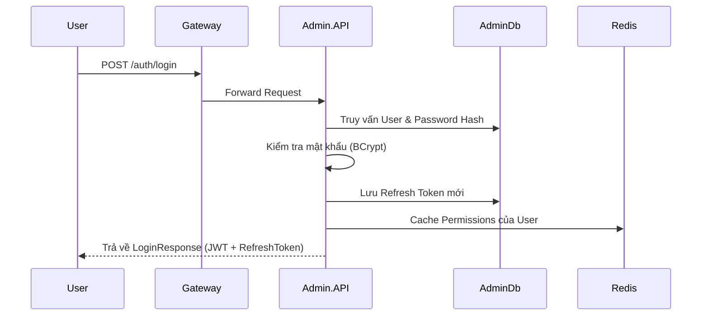
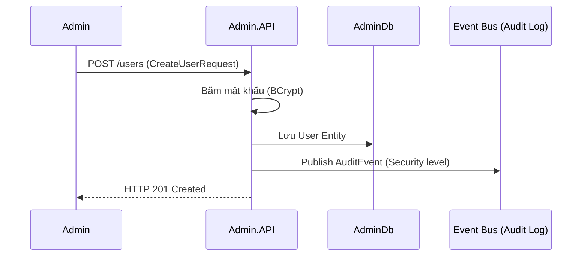
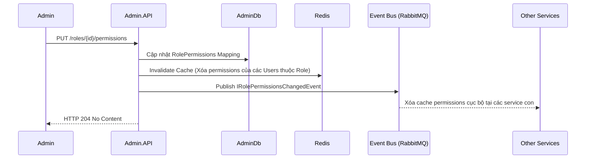

# BIZCORE ERP: ADMIN SERVICE DESIGN (ENTERPRISE ORGANIZATION, IDENTITY & MASTER DATA)

## 1. Tầm nhìn Kiến trúc (Architectural Vision)

**Admin Service** (được nâng cấp từ Identity Service) đóng vai trò là "Nguồn dữ liệu gốc" (Source of Truth) cho toàn bộ hệ thống ERP. 

Trong các hệ thống ERP Enterprise, cấu trúc doanh nghiệp (Enterprise Structure) là **Master Data dùng chung**, không thuộc riêng bất kỳ phân hệ nào (như Kế toán hay Nhân sự). Việc tách biệt này giúp:
- **Tránh "God Service"**: Các service khác chỉ lưu ID tham chiếu và gọi Admin Service khi cần thông tin chi tiết.
- **Tính nhất quán**: Một thay đổi về cơ cấu tổ chức (ví dụ: đổi tên chi nhánh) sẽ được phản ánh ngay lập tức trên toàn hệ thống thông qua Event-Driven (RabbitMQ).

---

## 2. Các phân hệ chính (Bounded Contexts)

Admin Service hợp nhất 3 lĩnh vực quản trị cốt lõi:

### 2.1 Identity & Authorization (Phân hệ Định danh & Phân quyền)
Trung tâm bảo mật cung cấp giải pháp **Dynamic Authorization**.
- **Xác thực**: OAuth2/OpenID Connect, JWT (Access/Refresh Token Rotation).
- **Phân quyền động**: Phân quyền theo Menu, Page, Action, Field và Data-level.
- **Caching**: Sử dụng **Redis** để lưu trữ permissions, đảm bảo hiệu năng cao với cơ chế Invalidate Cache thời gian thực.

### 2.2 Enterprise Organization (Cấu trúc Doanh nghiệp)
Quản trị sơ đồ tổ chức đa cấp:
- **LegalEntity**: Pháp nhân độc lập có MST và báo cáo tài chính riêng.
- **Branch**: Chi nhánh phụ thuộc.
- **Department**: Phòng ban (hỗ trợ cấu trúc cây - Parent/Child).
- **CostCenter**: Trung tâm chi phí phục vụ kế toán quản trị.

### 2.3 Global Settings & Master Data
- **Currency**: Danh mục tiền tệ ISO 4217.
- **SystemCalendar**: Lịch làm việc chung và ngày lễ.
- **GlobalSettings**: Các tham số cấu hình hệ thống (Key-Value).

---

## 3. Quy trình nghiệp vụ (Business Workflows)

### 3.1 Quy trình Xác thực & Cấp Token (Authentication Flow)
Đảm bảo an toàn qua JWT Rotation và Lockout policy.

### 3.2 Quy trình Tạo mới Người dùng (User Creation Flow)
Đảm bảo mật khẩu được băm an toàn và có vết Audit log.

### 3.3 Quy trình Phân quyền & Invalidate Cache (Authorization Flow)
Cơ chế đảm bảo quyền hạn mới có hiệu lực ngay lập tức toàn hệ thống.

---

## 4. Danh mục API Endpoints (API Reference)

### 4.1 Authentication & Profile (Xác thực & Cá nhân)
| Endpoint | Method | Chức năng | Phân quyền |
|----------|--------|-----------|------------|
| `/auth/login` | POST | Đăng nhập lấy JWT | Anonymous |
| `/auth/refresh` | POST | Làm mới Access Token (Rotation) | Anonymous |
| `/auth/logout` | POST | Đăng xuất (thu hồi Refresh Token) | [Authorize] |
| `/auth/change-password` | POST | Người dùng tự đổi mật khẩu | [Authorize] |
| `/me/permissions` | GET | Lấy danh sách quyền hiện tại của tôi | [Authorize] |
| `/me/navigation` | GET | Lấy danh sách menu động theo quyền | [Authorize] |

### 4.2 User Management (Quản lý Người dùng)
| Endpoint | Method | Chức năng | Quyền hạn yêu cầu |
|----------|--------|-----------|--------------------|
| `/users` | GET | Danh sách người dùng | `Identity.Users.View` |
| `/users` | POST | Tạo người dùng mới | `Identity.Users.Create` |
| `/users/{id}` | GET | Chi tiết người dùng | `Identity.Users.View` |
| `/users/{id}` | PUT | Cập nhật người dùng | `Identity.Users.Update` |
| `/users/{id}/roles` | PUT | Gán Roles cho người dùng | `Identity.Users.ManageRoles` |
| `/users/{id}/unlock` | POST | Mở khóa tài khoản | `Identity.Users.Update` |

### 4.3 Role & Permission Management (Vai trò & Quyền hạn)
| Endpoint | Method | Chức năng | Quyền hạn yêu cầu |
|----------|--------|-----------|--------------------|
| `/roles` | GET | Danh sách vai trò | `Identity.Roles.View` |
| `/roles` | POST | Tạo vai trò mới | `Identity.Roles.Create` |
| `/roles/{id}/permissions` | PUT | Gán Permissions cho vai trò | `Identity.Roles.ManagePermissions` |
| `/roles/permissions` | GET | Danh sách tất cả permissions | `Identity.Roles.View` |

### 4.4 Organization Management (Cấu trúc tổ chức)
| Endpoint | Method | Chức năng | Quyền hạn yêu cầu |
|----------|--------|-----------|--------------------|
| `/org/legal-entities` | GET | Danh sách pháp nhân | `Admin.OrgView` |
| `/org/legal-entities` | POST | Tạo mới pháp nhân | `Admin.SysAdmin` |
| `/org/branches` | GET | Danh sách chi nhánh | `Admin.OrgView` |
| `/org/departments` | GET | Sơ đồ phòng ban (Dạng Tree) | `Admin.OrgView` |
| `/org/cost-centers` | GET | Danh mục trung tâm chi phí | `Admin.OrgView` |

### 4.5 System Settings (Cấu hình hệ thống)
| Endpoint | Method | Chức năng | Quyền hạn yêu cầu |
|----------|--------|-----------|--------------------|
| `/system/currencies` | GET | Danh mục tiền tệ | `Admin.SystemView` |
| `/system/settings` | GET | Danh sách cấu hình hệ thống | `Admin.SystemView` |
| `/system/settings/{key}` | GET | Lấy giá trị cấu hình theo Key | `Admin.SystemView` |
| `/system/settings/{key}` | PUT | Cập nhật giá trị cấu hình | `Admin.SysAdmin` |
| `/system/calendar/{year}` | GET | Lấy lịch làm việc theo năm | `Admin.SystemView` |
| `/system/calendar` | POST | Cập nhật ngày nghỉ/làm việc | `Admin.SysAdmin` |

---
*Tài liệu cập nhật ngày: 11/05/2026 sau khi hoàn tất nâng cấp và rebranding từ Identity Service.*
