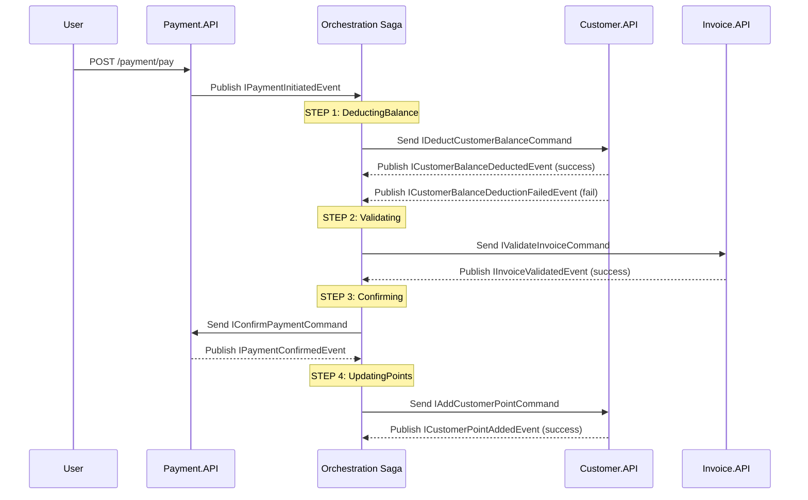
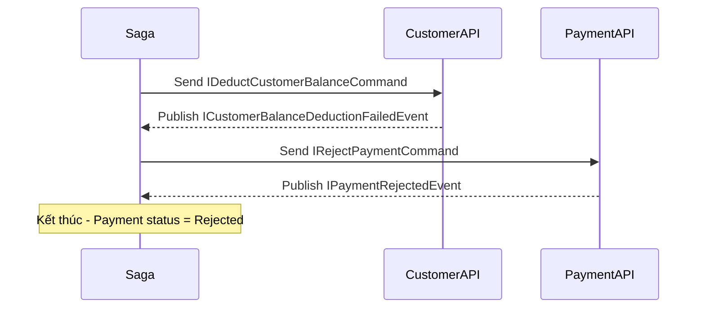
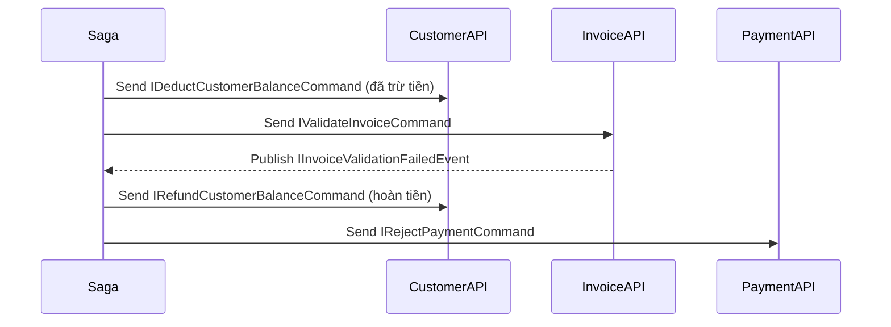
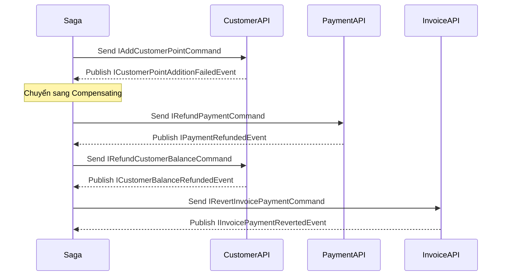

# Customer Service - Nghiệp vụ Khách hàng

## 1. Tổng quan

**Customer Service** là microservice chịu trách nhiệm quản lý thông tin khách hàng, số dư tài khoản, điểm tích lũy (Customer Point), và nhóm khách hàng (CustomerGroup). Service này giao tiếp với các service khác thông qua **RabbitMQ (MassTransit)** theo kiến trúc Event-Driven.

Vai trò trong luồng nghiệp vụ cốt lõi:
- Quản lý thông tin cá nhân và phân nhóm khách hàng
- Quản lý số dư tài khoản (`SoTienTrongTaiKhoan`) - được trừ khi thanh toán hóa đơn
- Quản lý điểm thưởng (`CustomerPoint`) - được cộng sau khi thanh toán thành công
- Quản lý tổng tiền hóa đơn (`SoTienTongHoaDon`) - phản ánh tổng giá trị giao dịch

---

## 2. Cấu trúc Domain Entities

### 2.1. Customers (`Customers.cs`)

Kế thừa `BaseEntity` (Id, CreatedAt, UpdatedAt, Version).

| Field | Type | Default | Mô tả |
|---|---|---|---|
| `FirstName` | `string` | required | Tên khách hàng |
| `LastName` | `string` | required | Họ khách hàng |
| `Email` | `string` | required | Email (phải chứa `@`) |
| `Phone` | `string` | required | Số điện thoại (9-15 ký tự) |
| `Address` | `string` | optional | Địa chỉ |
| `CustomerPoint` | `int` | `0` | Điểm tích lũy |
| `Status` | `CustomerStatus` | `CreatedUser` | Trạng thái (Active=0, CreatedUser=1, Blocked=2) |
| `CustomerGroupId` | `Guid?` | `null` | FK đến CustomerGroup |
| `CustomerGroup` | `CustomerGroup?` | `null` | Navigation property |
| `SoTienTrongTaiKhoan` | `int` | `0` | Số dư tài khoản (dùng để thanh toán) |
| `SoTienTongHoaDon` | `int` | `0` | Tổng tiền hóa đơn đã thanh toán |

**Domain Methods:**

| Method | Mô tả |
|---|---|
| `Create(...)` | Factory method - tạo khách hàng mới (có validation) |
| `Update(...)` | Cập nhật thông tin |
| `MarkAsDeleted()` | Soft delete - chuyển status thành `Blocked` |
| `AddPoints(int)` | Cộng điểm thưởng (không âm) |
| `AddMoney(int)` | Nạp tiền vào tài khoản |
| `AddMoneyToTotal(int)` | Cộng dồn vào tổng hóa đơn |
| `DeductBalance(int)` | Trừ tiền tài khoản - ném `InvalidOperationException` nếu không đủ |
| `RefundBalance(int)` | Hoàn tiền lại tài khoản (khi rollback) |

### 2.2. CustomerGroup (`CustomerGroup.cs`)

Kế thừa `BaseEntity`. Dùng để phân loại khách hàng theo nhóm (VIP, Thường, Đại lý...).

| Field | Type | Default | Mô tả |
|---|---|---|---|
| `NameCustomerGroup` | `string` | required | Tên nhóm khách hàng |
| `Code` | `string` | required | Mã nhóm |
| `Description` | `string` | optional | Mô tả |
| `Status` | `CustomerGroupStatus` | `Active` | Active=0, Blocked=1 |

**Quan hệ:** Một CustomerGroup có nhiều Customers (1:N) thông qua `CustomerGroupId`.

### 2.3. Enums

**CustomerStatus:**
- `Active = 0` - Khách hàng hoạt động bình thường
- `CreatedUser = 1` - Khách hàng đã tạo tài khoản user
- `Blocked = 2` - Khách hàng bị khóa

**CustomerGroupStatus:**
- `Active = 0` - Nhóm đang hoạt động
- `Blocked = 1` - Nhóm bị khóa

---

## 3. API Endpoints

| Method | Endpoint | Mô tả |
|---|---|---|
| GET | `/api/v1/customers` | Danh sách khách hàng |
| GET | `/api/v1/customers/{id}` | Chi tiết khách hàng |
| POST | `/api/v1/customers` | Tạo khách hàng mới |
| PUT | `/api/v1/customers/{id}` | Cập nhật khách hàng |
| DELETE | `/api/v1/customers/{id}` | Xóa (soft) khách hàng |
| GET | `/api/v1/customer-groups` | Danh sách nhóm khách hàng |
| GET | `/api/v1/customer-groups/{id}` | Chi tiết nhóm |
| POST | `/api/v1/customer-groups` | Tạo nhóm mới |
| PUT | `/api/v1/customer-groups/{id}` | Cập nhật nhóm |
| DELETE | `/api/v1/customer-groups/{id}` | Xóa (soft) nhóm |

---

## 4. Luồng bất đồng bộ (Event-Driven)

### 4.1. Tổng quan luồng

Khi người dùng thực hiện thanh toán hóa đơn (Invoice → Payment), Customer bị ảnh hưởng qua 3 giai đoạn:

```
[Thanh toán] → 1. Trừ tiền tài khoản → 2. Validate hóa đơn
                                    → 3. Cộng điểm thưởng (nếu thành công)
                                    → (hoặc) Hoàn tiền (nếu thất bại)
```

### 4.2. Sequence Diagram



### 4.3. Luồng thành công (Happy Path)

**Bước 1 - Trừ tiền tài khoản (`DeductingBalance`)**

| Thành phần | Hành động | Event/Command |
|---|---|---|
| Payment.API | Tạo payment record `Processing` | Publish `IPaymentInitiatedEvent` |
| Saga | Nhận event, chuyển state `DeductingBalance` | Gửi `IDeductCustomerBalanceCommand` |
| Customer.API Consumer | Nhận command, gọi `customer.DeductBalance(amount)` | Publish `ICustomerBalanceDeductedEvent` |
| Kiểm tra số dư | `SoTienTrongTaiKhoan >= amount` | Nếu không đủ → `ICustomerBalanceDeductionFailedEvent` |

**Bước 2 - Validate hóa đơn (`Validating`)**

| Thành phần | Hành động |
|---|---|
| Saga | Nhận `ICustomerBalanceDeductedEvent` → chuyển state `Validating` |
| Saga | Gửi `IValidateInvoiceCommand` tới Invoice.API |
| Invoice.API | Kiểm tra hóa đơn tồn tại, số tiền khớp |
| Invoice.API | Publish `IInvoiceValidatedEvent` (hoặc `IInvoiceValidationFailedEvent`) |

**Bước 3 - Xác nhận thanh toán (`Confirming`)**

| Thành phần | Hành động |
|---|---|
| Saga | Nhận `IInvoiceValidatedEvent` → chuyển state `Confirming` |
| Saga | Gửi `IConfirmPaymentCommand` tới Payment.API |
| Payment.API | Cập nhật payment `Status = Completed` |
| Payment.API | Publish `IPaymentConfirmedEvent` |

**Bước 4 - Cộng điểm thưởng (`UpdatingPoints`)**

| Thành phần | Hành động | Event/Command |
|---|---|---|
| Saga | Nhận `IPaymentConfirmedEvent` → chuyển state `UpdatingPoints` | Gửi `IAddCustomerPointCommand` |
| Customer.API Consumer | Nhận command, tính điểm: `points = max(1, amount / 10)` | Publish `ICustomerPointAddedEvent` |

**Kết quả cuối cùng trên Customer:**
- `SoTienTrongTaiKhoan` giảm đi số tiền thanh toán
- `CustomerPoint` tăng thêm (1 điểm / 10 đơn vị tiền)
- `SoTienTongHoaDon` tăng thêm số tiền thanh toán (qua `AddMoneyToTotal`)

### 4.4. Luồng thất bại & Compensation (Rollback)

#### Trường hợp 1: Không đủ tiền trong tài khoản



**Ảnh hưởng đến Customer:** Không thay đổi gì (chưa trừ tiền).

#### Trường hợp 2: Validate hóa đơn thất bại



**Ảnh hưởng đến Customer:**
- `SoTienTrongTaiKhoan` bị trừ → sau đó được hoàn lại (qua `RefundBalance`)

#### Trường hợp 3: Cộng điểm thất bại



**Ảnh hưởng đến Customer:**
- Tiền được hoàn lại đầy đủ (compensation)
- Không nhận được điểm thưởng

### 4.5. Danh sách Contracts (Message Contracts)

| Interface | Mô tả | Gửi từ | Đến |
|---|---|---|---|
| `IPaymentInitiatedEvent` | Thanh toán được khởi tạo | Payment.API | Saga |
| `IDeductCustomerBalanceCommand` | Yêu cầu trừ tiền tài khoản | Saga | Customer.API |
| `ICustomerBalanceDeductedEvent` | Trừ tiền thành công | Customer.API | Saga |
| `ICustomerBalanceDeductionFailedEvent` | Trừ tiền thất bại | Customer.API | Saga |
| `IAddCustomerPointCommand` | Yêu cầu cộng điểm thưởng | Saga | Customer.API |
| `ICustomerPointAddedEvent` | Cộng điểm thành công | Customer.API | Saga |
| `ICustomerPointAdditionFailedEvent` | Cộng điểm thất bại | Customer.API | Saga |
| `IRefundCustomerBalanceCommand` | Yêu cầu hoàn tiền (rollback) | Saga | Customer.API |
| `ICustomerBalanceRefundedEvent` | Hoàn tiền thành công | Customer.API | Saga |

### 4.6. Saga State Machine

Saga `PaymentSaga` trong Orchestration.API quản lý toàn bộ vòng đời giao dịch với các state:

```
PaymentInitiated
    → DeductingBalance
        → CustomerBalanceDeducted → Validating
        → CustomerBalanceDeductionFailed → Rejected
    → Validating
        → InvoiceValidated → Confirming
        → InvoiceValidationFailed → Compensating (refund balance)
    → Confirming
        → PaymentConfirmed → UpdatingPoints
        → Timeout → Compensating
    → UpdatingPoints
        → CustomerPointAdded → Completed (final)
        → CustomerPointAdditionFailed → Compensating
    → Compensating
        → PaymentRefunded → RefundingBalance
    → RefundingBalance
        → CustomerBalanceRefunded → Reverting
    → Reverting
        → InvoicePaymentReverted → Completed (final)
```

Mỗi state có timeout **30 giây**. Nếu quá thời gian, saga chuyển sang `TimedOut` và thực hiện compensation.

### 4.7. Audit & Observability

Mọi thao tác làm thay đổi dữ liệu Customer đều được ghi nhận qua `IAuditPublisher`:

| Hành động | Audit Action | Classification |
|---|---|---|
| Trừ tiền tài khoản | `CustomerBalanceDeducted` | Financial |
| Hoàn tiền tài khoản | `CustomerBalanceRefunded` | Financial |
| Cộng điểm thưởng | `CustomerPointAdded` | Financial |

---

## 5. Consumers (Message Handlers)

Customer.API có 3 consumers lắng nghe command từ Saga:

| Consumer | Command | Xử lý |
|---|---|---|
| `DeductCustomerBalanceConsumer` | `IDeductCustomerBalanceCommand` | Kiểm tra & trừ tiền, publish kết quả |
| `RefundCustomerBalanceConsumer` | `IRefundCustomerBalanceCommand` | Hoàn tiền vào tài khoản khi rollback |
| `AddCustomerPointConsumer` | `IAddCustomerPointCommand` | Ủy quyền cho MediatR để cộng điểm |
