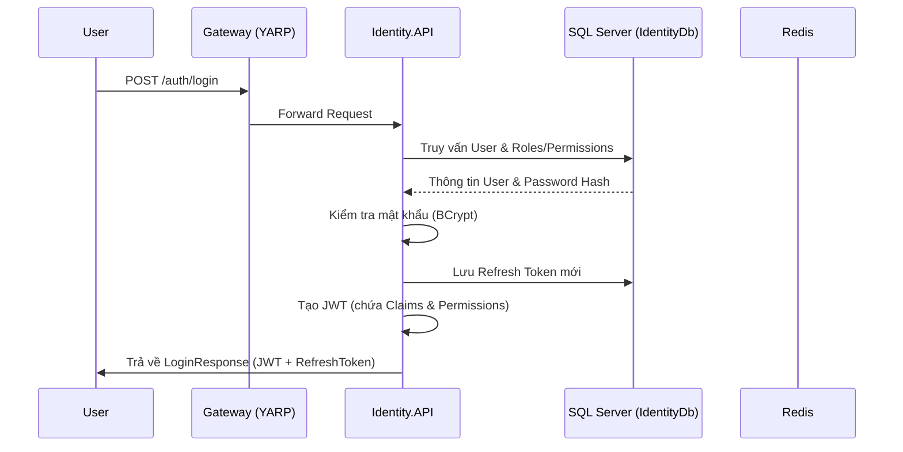
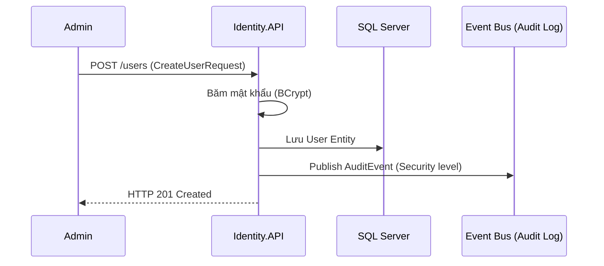
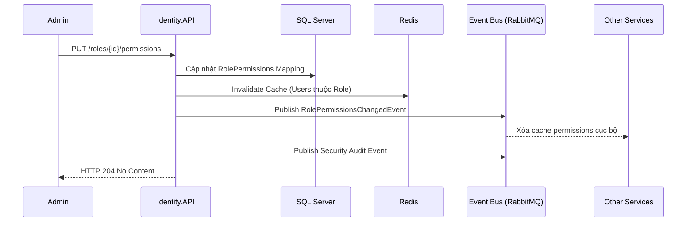

# Identity Service

## 🎯 Tổng quan (Overview)

**Identity Service** là trung tâm bảo mật của BizCore ERP, cung cấp giải pháp **Dynamic Authorization** hiện đại. Nó không chỉ quản lý định danh người dùng (Authentication) mà còn cung cấp cơ chế phân quyền động (Dynamic Permissions) theo Menu, Action, Field và Data-level.

## 🧱 Cấu trúc (Architecture)

* **Port nội bộ**: `5005`
* **Cơ sở dữ liệu**: `IdentityDb` (SQL Server)
* **Caching**: **Redis** (Lưu trữ user permissions để tối ưu hiệu năng)
* **Công nghệ cốt lõi**:
  * **JWT (JSON Web Token)**: Cấp phát Access Token và Refresh Token. Claim `permission` chứa các code dạng PascalCase (ví dụ: `Invoice.View`).
  * **Dynamic Policy Provider**: Sử dụng `IAuthorizationPolicyProvider` tùy chỉnh để tự động tạo Policy từ chuỗi Permission Name nhận được từ Attribute `[RequirePermission]`.
  * **Permission Handler**: Đánh giá quyền dựa trên mô hình lai: Redis (Real-time) -> JWT Claims (Fallback).
  * **BCrypt**: Băm mật khẩu bảo mật.
  * **MassTransit (RabbitMQ)**: Publish Audit Events và `IRolePermissionsChangedEvent` để đồng bộ trạng thái cache toàn hệ thống.

## 🔑 Các tính năng chính (Key Features)

1. **Xác thực (Authentication)**:
   * Đăng nhập, Refresh Token Rotation, Lockout Policy.
2. **Dynamic Authorization**:
   * **Permission-based**: Phân quyền dựa trên Code (ví dụ: `Invoice.Create`).
   * **Menu-based**: Render menu động thông qua endpoint `/me/navigation`.
   * **Field-level**: Kiểm soát quyền truy cập đến từng trường dữ liệu (đang triển khai).
   * **Runtime Refresh**: Cập nhật quyền của người dùng ngay lập tức thông qua cơ chế Invalidate Redis Cache.
3. **Quản lý Tài khoản (Account Management)**:
   * Profile, Đổi mật khẩu, Quản lý Role/Permission.

## 📊 Quy trình hoạt động (Workflow Diagrams)

### 1. Quy trình Xác thực (Authentication Flow)

Quy trình từ lúc người dùng gửi yêu cầu đăng nhập cho đến khi nhận được Access Token và Refresh Token.

### 2. Quy trình Tạo User (User Creation Flow)

Đảm bảo mật khẩu được băm an toàn và có vết Audit log.

### 3. Quy trình Phân quyền & Invalidation (Authorization & Cache Invalidation)

Cơ chế đảm bảo quyền hạn mới có hiệu lực ngay lập tức toàn hệ thống.

## 🔗 Endpoint API (API Endpoints)

| Endpoint | Method | Chức năng | Phân quyền yêu cầu |
| --- | --- | --- | --- |
| **Auth** | | | |
| `/auth/login` | POST | Đăng nhập và lấy JWT | Anonymous |
| `/auth/refresh` | POST | Làm mới Access Token (Rotation) | Anonymous |
| `/auth/logout` | POST | Đăng xuất (thu hồi Refresh Token) | [Authorize] |
| `/auth/change-password` | POST | Người dùng tự đổi mật khẩu | [Authorize] |
| **Profile** | | | |
| `/me/permissions` | GET | Lấy danh sách quyền của user hiện tại | [Authorize] |
| `/me/navigation` | GET | Lấy danh sách menu động theo quyền | [Authorize] |
| **Users** | | | |
| `/users` | GET | Danh sách người dùng | `Identity.Users.View` |
| `/users` | POST | Tạo người dùng mới | `Identity.Users.Create` |
| `/users/{id}` | GET | Chi tiết người dùng | `Identity.Users.View` |
| `/users/{id}` | PUT | Cập nhật thông tin người dùng | `Identity.Users.Update` |
| `/users/{id}` | DELETE | Vô hiệu hóa người dùng | `Identity.Users.Delete` |
| `/users/{id}/roles` | PUT | Gán Roles cho người dùng | `Identity.Users.ManageRoles` |
| `/users/{id}/unlock` | POST | Mở khóa tài khoản | `Identity.Users.Update` |
| **Roles & Permissions** | | | |
| `/roles` | GET | Danh sách các Role | `Identity.Roles.View` |
| `/roles` | POST | Tạo Role mới | `Identity.Roles.Create` |
| `/roles/{id}` | GET | Chi tiết Role & Quyền | `Identity.Roles.View` |
| `/roles/{id}` | PUT | Cập nhật tên/mô tả Role | `Identity.Roles.Update` |
| `/roles/{id}` | DELETE | Xóa Role | `Identity.Roles.Delete` |
| `/roles/{id}/permissions` | PUT | Gán Permissions cho Role | `Identity.Roles.ManagePermissions` |
| `/roles/permissions` | GET | Danh sách tất cả Permission hệ thống | `Identity.Roles.View` |

## 🛡️ Tích hợp Cache & Audit

* **Redis Cache**: Mọi request kiểm tra quyền sẽ truy vấn Redis trước khi fallback về SQL Server hoặc JWT. Mặc định TTL là 5 phút. Key format: `user_permissions:{userId}`.

* **Audit Integration**: Ghi log mọi thay đổi Role/Permission với mức độ **Security**.
* **Permission Changed Event**: Khi một Role bị thay đổi permission qua `RoleService.AssignPermissionsAsync`:
    1. Identity xóa cache Redis của tất cả người dùng thuộc Role đó.
    2. Publish `IRolePermissionsChangedEvent`.
    3. Các Microservice nhận event có thể thực hiện xóa cache local (nếu có) để đảm bảo tính nhất quán tức thì.

---
*Tài liệu cập nhật ngày: 08/05/2026 sau khi hoàn thành Phase 3: Real-time Cache Invalidation & Security Audit.*
