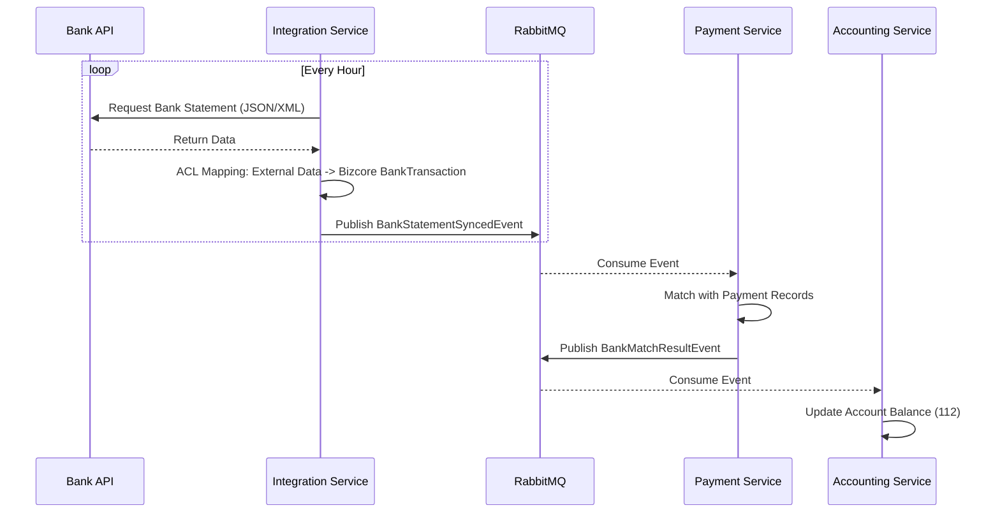
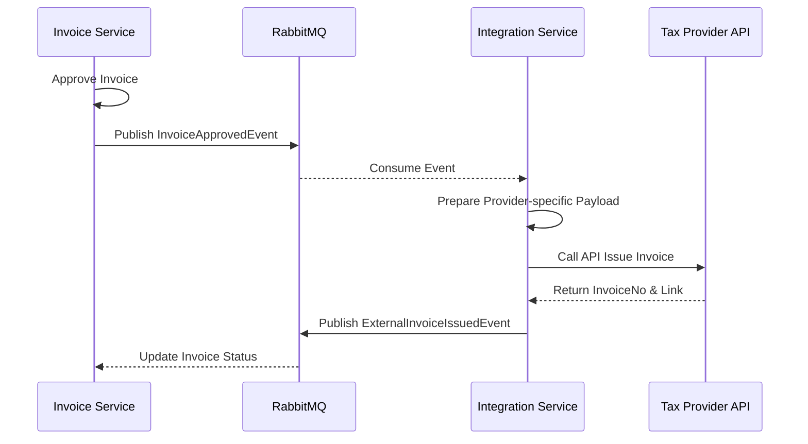

# BIZCORE ERP: INTEGRATION SERVICE DESIGN - EXTERNAL API ACL (V1)

## 1. Tầm nhìn Kiến trúc (Architectural Vision)

**Integration Service** đóng vai trò là một **Anti-Corruption Layer (ACL)**. Trong một hệ thống ERP Enterprise, việc kết nối với các hệ thống bên ngoài (Ngân hàng, Cơ quan Thuế, Đơn vị vận chuyển) luôn tiềm ẩn rủi ro về việc thay đổi API của bên thứ ba làm hỏng logic hệ thống nội bộ.

Dịch vụ này giải quyết các vấn đề:
- **Cô lập thay đổi (Isolation)**: Chỉ Integration Service phải thay đổi khi API bên ngoài thay đổi. Các dịch vụ core (Accounting, Payment) vẫn giữ nguyên Domain Model.
- **Bảo mật (Security)**: Tập trung quản lý Credential (API Keys, Token, Certificates) tại một điểm và mã hóa chúng.
- **Độ tin cậy (Resilience)**: Xử lý retry, circuit breaker và rate limiting riêng biệt cho từng nhà cung cấp.

---

## 2. Các phân hệ chính (Bounded Contexts)

### 2.1 e-Banking Module (Kết nối Ngân hàng)
Cung cấp khả năng giao tiếp trực tiếp với hệ thống ngân hàng điện tử (Vietcombank, BIDV, Techcombank...).
- **Connection Management (NH-EB01)**: Cấu hình và kiểm tra kết nối.
- **Real-time Inquiry (NH-EB02)**: Truy vấn số dư và trạng thái giao dịch.
- **Bank Statement Sync (NH-EB04)**: Tự động lấy sao kê và map về Bizcore Bank Transaction model.

### 2.2 e-Invoice Module (Liên kết Hóa đơn điện tử)
Tương tác với các nhà cung cấp HĐĐT (M-Invoice, VNPT, Viettel, v.v.).
- **Invoice Submission (TH-17)**: Đẩy dữ liệu hóa đơn đã duyệt sang bên thứ ba để cấp số hóa đơn.
- **Status Tracking**: Theo dõi trạng thái ký, phát hành và hủy hóa đơn.

---

## 3. Quy trình nghiệp vụ (Business Workflows)

### 3.1 Quy trình Đối soát Ngân hàng (Bank Reconciliation Flow)



### 3.2 Quy trình Phát hành Hóa đơn điện tử (e-Invoice Issuance)



---

## 4. Thiết kế Dữ liệu & Bảo mật

### 4.1 Quản lý Credential (Secure Vault)
Dữ liệu nhạy cảm được mã hóa bằng **AES-256** với khóa được lưu trong Environment Variables hoặc Secret Manager.

```sql
IntegrationCredential (
    Id UNIQUEIDENTIFIER PK,
    LegalEntityId UNIQUEIDENTIFIER NOT NULL,
    ProviderCode NVARCHAR(50),      -- 'VCB', 'MINVOICE'
    Environment NVARCHAR(20),       -- 'SANDBOX', 'PRODUCTION'
    
    ApiKey NVARCHAR(MAX),           -- Encrypted
    ApiSecret NVARCHAR(MAX),        -- Encrypted
    CertificateData VARBINARY(MAX), -- Encrypted
    
    IsActive BIT,
    LastValidatedAt DATETIME2
)
```

### 4.2 Lịch sử Giao tiếp (Integration Logs)
Lưu vết mọi request/response với bên thứ ba để phục vụ debug và đối soát lỗi kỹ thuật.

```sql
IntegrationLog (
    Id UNIQUEIDENTIFIER PK,
    ProviderCode NVARCHAR(50),
    Endpoint NVARCHAR(500),
    RequestMethod NVARCHAR(10),
    
    RequestBody NVARCHAR(MAX),
    ResponseBody NVARCHAR(MAX),
    StatusCode INT,
    
    DurationMs INT,
    CorrelationId UNIQUEIDENTIFIER,
    Timestamp DATETIME2
)
```

---

## 5. Giao thức Tích hợp (Integration Contracts)

### 5.1 Command: `SyncBankStatementCommand`
Gửi từ Payment/Accounting hoặc Job Scheduler để yêu cầu đồng bộ.

### 5.2 Event: `BankStatementSyncedEvent`
```json
{
  "ProviderCode": "VCB",
  "BankAccount": "001100...",
  "Transactions": [
    {
      "ExternalId": "TX12345",
      "Amount": 5000000.00,
      "EntryType": "D",
      "TransactionDate": "2024-05-11T10:00:00",
      "Description": "THANH TOAN HD 123"
    }
  ]
}
```

---

## 6. Quyết định Kiến trúc (Architectural Decisions)

| Quyết định | Lý do (Rationale) |
| :--- | :--- |
| **ACL Mapping** | Ngăn chặn sự thay đổi schema của Bank/Tax làm sụp đổ logic ERP nội bộ. |
| **Circuit Breaker** | Nếu API Vietcombank bị chậm, hệ thống sẽ ngắt kết nối tạm thời để không làm treo các thread xử lý nội bộ. |
| **Encrypted Storage** | Bảo vệ API keys khỏi rủi ro rò rỉ dữ liệu database. |
| **Idempotency** | Đảm bảo một sao kê ngân hàng không bị import trùng lặp nếu hệ thống retry. |
