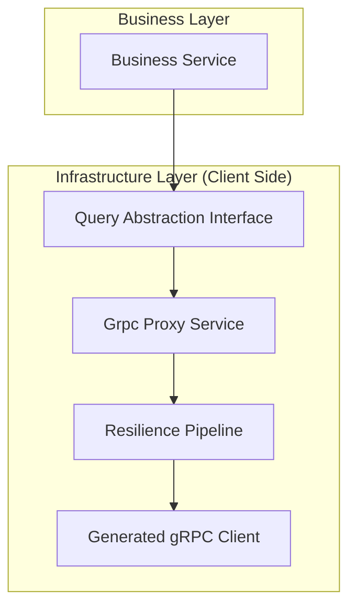

# Hướng dẫn Giao tiếp gRPC (Chuẩn Production)

Tài liệu này quy định các tiêu chuẩn và hướng dẫn triển khai gRPC cho môi trường Production trong hệ sinh thái Bizcore ERP.

## 1. Kiến trúc Tổng thể (Standard Architecture)

Chúng ta **KHÔNG** sử dụng trực tiếp raw gRPC client trong các dịch vụ nghiệp vụ (Business Layer). Thay vào đó, chúng ta sử dụng một lớp trừu tượng (Abstraction Layer).



### Tại sao cần lớp trừu tượng?

- **Tách biệt mối quan tâm**: Domain/Business không cần biết về sự tồn tại của gRPC hay Protobuf.
- **Dễ dàng Unit Test**: Có thể mock Interface thay vì mock gRPC client phức tạp.
- **Tập trung hóa Resilience**: Gom các logic retry, timeout, logging vào một nơi duy nhất.

---

## 2. Phân định gRPC vs Messaging

| Hoạt động | Công nghệ | Mục đích |
| :--- | :--- | :--- |
| **Query/Read-only** | **gRPC** | Lấy dữ liệu tức thời (Synchronous) |
| **Business Command** | **RabbitMQ** | Yêu cầu thay đổi trạng thái (Asynchronous) |
| **Domain Event** | **RabbitMQ Publish** | Thông báo sự thay đổi (Event-driven) |
| **Workflow liên dịch vụ** | **Saga** | Quản lý giao dịch phân tán |
| **UI/Client API** | **REST/JSON** | Giao tiếp với bên ngoài |

> [!CAUTION]
> **KHÔNG** sử dụng gRPC để thực hiện các Command làm thay đổi dữ liệu xuyên dịch vụ (ví dụ: `CreateInvoice` qua gRPC). Hãy dùng Command Bus để đảm bảo tính nhất quán (Eventual Consistency).

---

## 3. Đăng ký Dịch vụ & Khả năng Chống chịu (Resilience)

Trong kiến trúc mới, chúng ta đăng ký gRPC client bên trong phương thức `RegisterServices` của **Module** thay vì `Program.cs`. Sử dụng tiện ích mở rộng `AddBizcoreGrpcClient` để tự động tích hợp các chính sách bảo vệ:

```csharp
// Trong MyServiceModule.cs
public void RegisterServices(IServiceCollection services, IConfiguration configuration, IHostBuilder host)
{
    services.AddBizcoreGrpcClient<InvoiceGrpc.InvoiceGrpcClient>(
        configuration, 
        "Invoice" // Key trong appsettings.json
    );
}
```

### Cấu hình trong appsettings.json

```json
"GrpcServices": {
  "Invoice": {
    "Url": "http://invoice-api:8080",
    "TimeoutSeconds": 3,
    "RetryCount": 2
  }
}
```

### Các chính sách mặc định được áp dụng

1. **Retry**: Tự động thử lại với lũy thừa thời gian chờ (Exponential Backoff) và Jitter.
2. **Circuit Breaker**: Ngắt kết nối nếu tỷ lệ lỗi vượt quá 50% trong 30 giây để tránh làm sập hệ thống (Cascading Failure).
3. **Timeout**: Giới hạn thời gian chờ tối đa cho mỗi lời gọi.
4. **Correlation ID**: Tự động truyền trace-id xuyên suốt các dịch vụ.

---

## 4. Xử lý Lỗi chuẩn hóa (Error Mapping)

Tuyệt đối không để `RpcException` lan truyền lên lớp nghiệp vụ. Sử dụng `GrpcErrorMapper` để chuyển đổi sang Domain Exception.

| Mã lỗi gRPC | Ý nghĩa | Chuyển đổi Domain |
| :--- | :--- | :--- |
| `NotFound` | Không tìm thấy thực thể | `NotFoundException` |
| `InvalidArgument` | Dữ liệu đầu vào sai | `DomainException` (Validation) |
| `Unavailable` | Dịch vụ chết/Ngắt mạch | `ServiceUnavailableException` |
| `DeadlineExceeded` | Quá thời gian chờ | `TimeoutException` |

---

## 5. Quy tắc Quản trị (Governance Rules)

### Quy tắc 2-Hops

Một yêu cầu nghiệp vụ đồng bộ không nên vượt quá **2 bước nhảy (hops)** gRPC.

- ✅ `API -> Order -> gRPC Inventory` (1 hop) - OK.
- ❌ `API -> Order -> gRPC Inventory -> gRPC Warehouse -> gRPC Supplier` (3 hops) - **NGHIÊM CẤM**.
- **Giải pháp**: Nếu chuỗi dài hơn, hãy sử dụng Cache, Denormalized Read Model hoặc Async Events.

### Protobuf Versioning

- **LUÔN LUÔN**: Thêm trường mới dưới dạng `optional`. Sử dụng `reserved` cho các trường đã xóa.
- **KHÔNG BAO GIỜ**: Đổi số hiệu trường (field number), đổi kiểu dữ liệu của trường hiện có.

---

## 6. Khả năng quan sát (Observability)

Hệ thống gRPC đã được tích hợp sẵn:

- **Distributed Tracing**: Tự động gắn kết các vết (spans) qua OpenTelemetry.
- **Metrics**: Theo dõi số lượng lời gọi, tỷ lệ lỗi và biểu đồ phân bố độ trễ (Latency Histogram).
- **Structured Logging**: Log chi tiết từng lời gọi kèm theo `CorrelationId`.

---

## 7. Caching cho dữ liệu nóng (Hot Data)

Đối với các dữ liệu được truy vấn cực nhiều (Permissions, User Info, Exchange Rates), hãy bọc lớp gRPC Proxy bằng một lớp Cache:

```csharp
public class CachedInvoiceService : IInvoiceService
{
    private readonly IMemoryCache _cache;
    private readonly InvoiceGrpcProxy _grpcProxy;
    
    public async Task<InvoiceDto> GetByIdAsync(Guid id)
    {
        return await _cache.GetOrCreateAsync($"inv_{id}", 
            entry => {
                entry.AbsoluteExpirationRelativeToNow = TimeSpan.FromMinutes(5);
                return _grpcProxy.GetByIdAsync(id);
            });
    }
}
```
