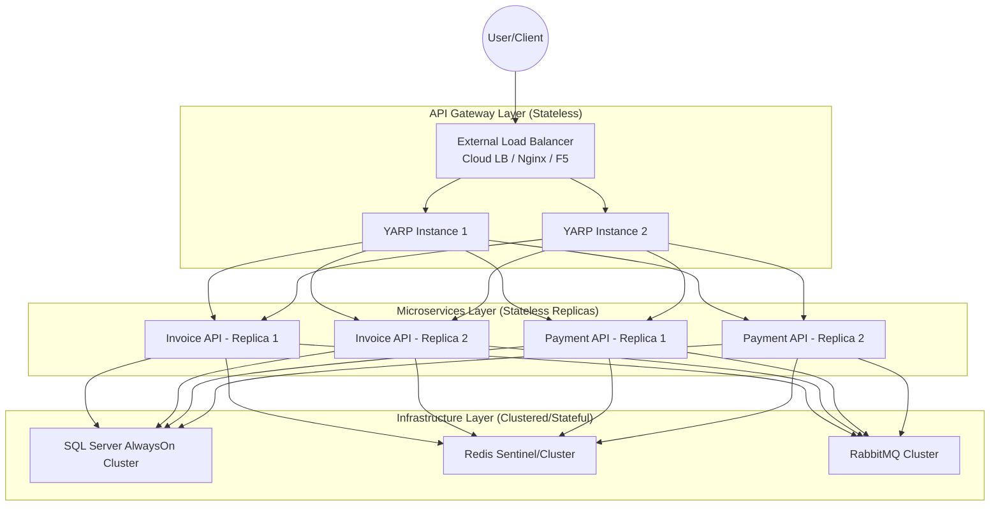

# 🌐 High Availability (HA) & Load Balancing (LB) Guide

Tài liệu này hướng dẫn cách triển khai Bizcore ERP trên môi trường thực tế (Production) để đảm bảo tính sẵn sàng cao và khả năng chịu tải.

---

## 1. Mô hình Tổng thể (Architecture Model)

Hệ thống được thiết kế để scale ngang ở tất cả các tầng.



---

## 2. Cấu hình Load Balancing tại Gateway (YARP)

YARP (Yet Another Reverse Proxy) đóng vai trò là Internal Load Balancer. Để cấu hình nhiều instance phía sau, bạn cập nhật `appsettings.json` hoặc biến môi trường:

### Cấu hình Destination

Thay vì trỏ đến 1 địa chỉ duy nhất, hãy liệt kê danh sách các instance:

```json
{
  "ReverseProxy": {
    "Clusters": {
      "invoice-cluster": {
        "LoadBalancingPolicy": "RoundRobin",
        "Destinations": {
          "instance1": { "Address": "http://invoice-api-1:8080" },
          "instance2": { "Address": "http://invoice-api-2:8080" }
        },
        "HealthCheck": {
          "Active": {
            "Enabled": "true",
            "Interval": "00:00:10",
            "Timeout": "00:00:02",
            "Policy": "ConsecutiveFailures",
            "Path": "/health"
          }
        }
      }
    }
  }
}
```

### Các Policy Load Balancing hỗ trợ

- `RoundRobin`: Luân phiên các instance (Mặc định).
- `LeastRequests`: Chuyển request đến instance đang ít việc nhất.
- `PowerOfTwoChoices`: Chọn ngẫu nhiên 2 instance và lấy cái ít việc hơn.
- `Random`: Chọn ngẫu nhiên.

---

## 3. Scale ngang Microservices

### Trong môi trường Kubernetes (Khuyến nghị)

Sử dụng `Replicas` trong Deployment:

```yaml
apiVersion: apps/v1
kind: Deployment
metadata:
  name: invoice-api
spec:
  replicas: 3 # Chạy 3 instance song song
  template:
    spec:
      containers:
      - name: invoice-api
        readinessProbe:
          httpGet:
            path: /health
            port: 8080
```

### Trong môi trường Docker Compose (Scaling)

Bạn có thể dùng lệnh:

```bash
docker-compose up -d --scale invoice-api=3
```

*Lưu ý: Khi dùng scale của Docker Compose, Gateway nên trỏ đến container name và Docker sẽ tự cân bằng tải qua Internal DNS.*

---

## 4. High Availability cho Hạ tầng (Stateful Services)

Đây là phần quan trọng nhất để đảm bảo hệ thống không bị gián đoạn dữ liệu.

### 4.1. SQL Server

- **Giải pháp**: SQL Server AlwaysOn Availability Groups.
- **Cấu hình**: Chạy ít nhất 2 Node (Primary và Secondary). Application dùng `MultiSubnetFailover=True` trong Connection String.

### 4.2. RabbitMQ

- **Giải pháp**: RabbitMQ Cluster với Quorum Queues.
- **Lợi ích**: Dữ liệu queue được replicate qua nhiều node. Nếu 1 node chết, các node khác vẫn phục vụ bình thường.

### 4.3. Redis

- **Giải pháp**: Redis Sentinel hoặc Redis Cluster.
- **Cấu hình**: Sentinel sẽ theo dõi Master node và tự động thăng cấp Slave node lên làm Master nếu có sự cố.

---

## 5. Health Checks & Tự phục hồi (Self-healing)

Hệ thống đã tích hợp `Microsoft.Extensions.Diagnostics.HealthChecks`.

- **Liveness Probe**: Kiểm tra service có còn sống không. Nếu chết, orchestrator sẽ restart lại.
- **Readiness Probe**: Kiểm tra service đã sẵn sàng nhận traffic chưa (đã kết nối được DB, Redis, RMQ chưa). Nếu chưa, Load Balancer sẽ không gửi request tới.

---

## 6. Lưu ý quan trọng khi chạy HA

1. **Idempotency**: Bắt buộc phải xử lý Idempotency (đã có sẵn trong Bizcore) vì trong môi trường HA, network retry có thể khiến 1 request được gửi đi nhiều lần.
2. **Distributed Locking**: Nếu có các tiến trình background chạy định kỳ (như Hangfire), cần dùng Redis hoặc SQL làm lock provider để tránh việc nhiều instance cùng chạy 1 job đồng thời.
3. **Sticky Sessions**: Hạn chế dùng Sticky Sessions (Session Affinity) tại Gateway để đạt được hiệu quả load balance tốt nhất. Do hệ thống dùng JWT và stateless nên không cần Sticky Sessions.

---
*Cập nhật lần cuối: 12/05/2026 - Hướng dẫn thiết kế High Availability cho Bizcore ERP.*
