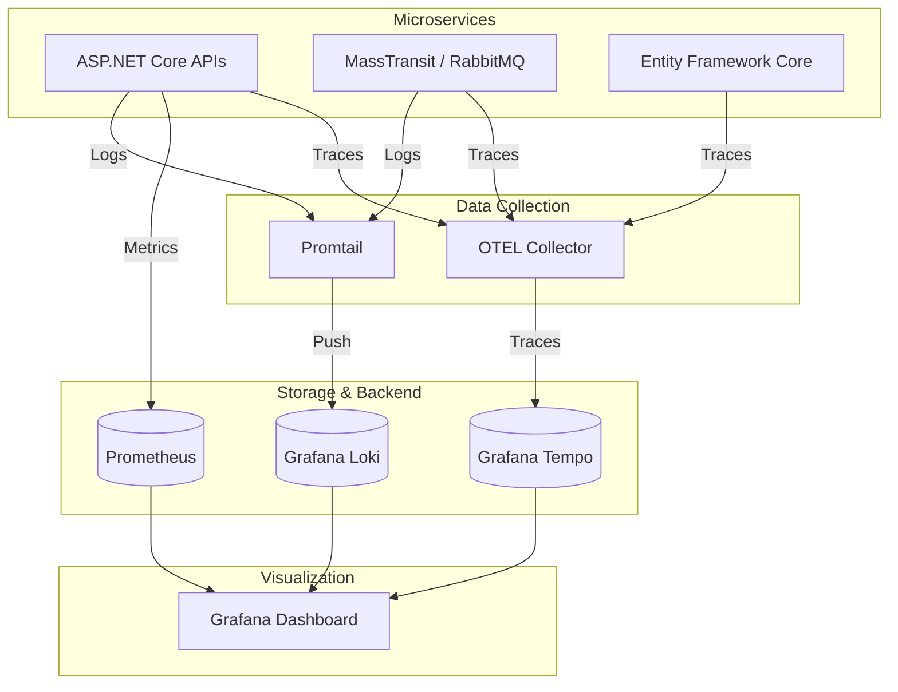

# Hướng dẫn Giám sát & Truy vết (Monitoring & Observability)

Tài liệu này hướng dẫn cách sử dụng bộ công cụ giám sát (Grafana, Loki, Prometheus, OpenTelemetry) trong hệ thống Bizcore ERP để theo dõi sức khỏe và debug lỗi.

---

## 1. Tổng quan Kiến trúc Giám sát

Hệ thống áp dụng mô hình **LGTM Stack** (Loki, Grafana, Tempo, Prometheus) kết hợp với **OpenTelemetry**:



* **Logs (Loki)**: Thu thập log có cấu trúc từ Serilog.
* **Metrics (Prometheus)**: Thu thập chỉ số hiệu năng (Latency, Error Rate, CPU/RAM).
* **Traces (OpenTelemetry)**: Truy vết luồng request xuyên suốt các Microservices.
* **Visualization (Grafana)**: Nơi hiển thị tất cả dữ liệu trên.

---

## 2. Truy cập các Công cụ

| Công cụ | URL mặc định | Tài khoản |
| :--- | :--- | :--- |
| **Grafana** | `http://localhost:3001` | `admin` / `admin` |
| **Prometheus** | `http://localhost:9090` | Không có |
| **RabbitMQ UI** | `http://localhost:15672` | `guest` / `guest` |
| **Loki API** | `http://localhost:3100` | Không có |

---

## 3. Hướng dẫn sử dụng Grafana

### 3.1. Cấu hình Data Sources (Lần đầu setup)

Nếu Grafana chưa có dữ liệu, hãy thêm các nguồn sau:

1. **Prometheus**: URL `http://prometheus:9090`
2. **Loki**: URL `http://loki:3100`
3. **Tempo**: URL `http://tempo:3200`

### 3.2. Import Dashboards chuẩn

Để theo dõi nhanh, hãy Import các Dashboard sau (Dùng ID):

* **ASP.NET Core Monitoring**: ID `19004` (Hiển thị Request/s, Error rate, GC).
* **Docker Container Stats**: ID `14527` (Hiển thị tài nguyên CPU/RAM của từng container).
* **Logs Centralized**: Tạo Dashboard mới với panel **Logs**, chọn source **Loki**.

---

## 4. Kỹ thuật Debug với Correlation ID

Đây là kỹ thuật quan trọng nhất để tìm lỗi trong Microservices.

1. **Tìm lỗi**: Khi API trả về lỗi hoặc bạn thấy log `Error` trong Grafana/Loki.
2. **Lấy ID**: Copy giá trị `CorrelationId` (thường nằm trong log hoặc header `X-Correlation-ID`).
3. **Truy vết toàn diện**:
    * Vào Grafana -> Explore -> Chọn Loki.
    * Query: `{service=~".+"} |= "MÃ_CORRELATION_ID"`
    * Bạn sẽ thấy toàn bộ log của các service liên quan đến request đó theo đúng trình tự thời gian.

---

## 5. Các chỉ số quan trọng cần theo dõi

* **HTTP 5xx Rate**: Nếu chỉ số này tăng đột biến, hệ thống đang gặp lỗi nghiêm trọng.
* **Request Latency (p95)**: Nếu > 2s, người dùng sẽ cảm thấy hệ thống chậm. Cần kiểm tra SQL hoặc gRPC timeout.
* **RabbitMQ Queue Length**: Nếu queue bị dồn ứ (Ready messages tăng), các Consumer đang xử lý quá chậm hoặc bị treo.
* **Circuit Breaker State**: Theo dõi xem có service nào đang ở trạng thái `Open` (Ngắt mạch) không.

---

## 6. Cấu hình trong Code (Dành cho Dev)

Mọi service mới tạo phải sử dụng các Extension Methods sau trong `Program.cs`:

```csharp
// 1. Logging (Loki + Console)
builder.Host.AddBizcoreLogging("My.API");

// 2. Metrics & Tracing (OpenTelemetry)
builder.Services.AddBizcoreTelemetry("My.API");

// 3. Pipeline (Expose /metrics endpoint)
app.UseBizcorePipeline("My API v1");
```

---
*Cập nhật lần cuối: 12/05/2026 - Khởi tạo hướng dẫn Monitoring.*
