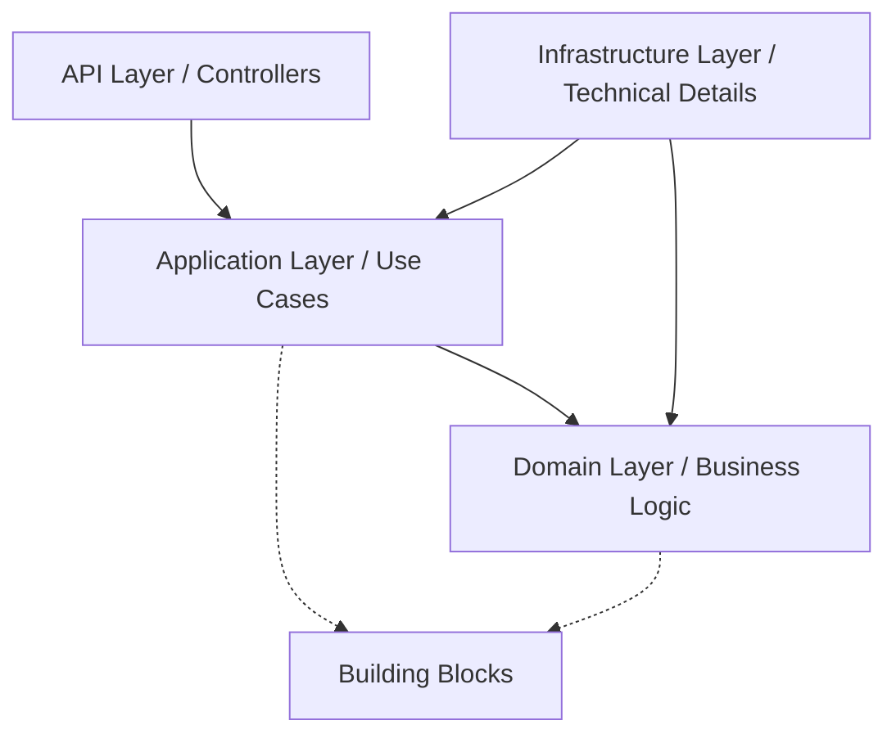

# 🚀 DEVELOPER GUIDE - BIZCORE ERP

Chào mừng bạn đến với tài liệu hướng dẫn phát triển của **Bizcore ERP**. Tài liệu này cung cấp các hướng dẫn kỹ thuật chi tiết để bạn có thể phát triển tính năng mới hoặc tạo một microservice mới một cách nhất quán và hiệu quả.

---

## 📖 MỤC LỤC

1. [Tổng quan kiến trúc (DDD-Lite)](#1-tổng-quan-kiến-trúc-ddd-lite)
2. [Cấu trúc Project](#2-cấu-trúc-project)
3. [Quy trình phát triển tính năng mới](#3-quy-trình-phát-triển-tính-năng-mới)
4. [Các Pattern cốt lõi & Building Blocks](#4-các-pattern-cốt-lõi--building-blocks)
5. [Hướng dẫn riêng cho từng Service](#5-hướng-dẫn-riêng-cho-từng-service)
6. [Checklist tạo Service mới](#6-checklist-tạo-service-mới)

---

## 1. 🏗️ Tổng quan kiến trúc (DDD-Lite)

Hệ thống Bizcore ERP áp dụng mô hình **DDD-Lite (Clean Architecture)** với 4 lớp chính để đảm bảo tính tách biệt (Separation of Concerns) và khả năng kiểm thử.



- **Domain Layer**: Trái tim của hệ thống, chứa thực thể (Entities), Logic nghiệp vụ thuần túy, và Exceptions. Không phụ thuộc vào bất kỳ framework nào.
- **Application Layer**: Điều phối luồng xử lý (Orchestration). Chứa Command/Query Handlers, Consumers, và DTOs.
- **Infrastructure Layer**: Triển khai chi tiết kỹ thuật (Database, External Clients, Migrations).
- **API Layer**: Cổng giao tiếp HTTP (REST endpoints), cấu hình DI, và Middleware.

---

## 2. 📁 Cấu trúc Project

Mỗi Microservice (ví dụ: `Invoice.API`) phải tuân thủ cấu trúc thư mục sau:

```text
Invoice.API/
├── Domain/
│   ├── Entities/       # Invoice.cs, Item.cs
│   ├── Enums/          # InvoiceStatus.cs
│   └── Exceptions/     # InvoiceDomainException.cs
├── Application/
│   ├── Commands/       # CreateInvoiceCommand.cs, Handlers
│   ├── Queries/        # GetInvoiceQuery.cs, Handlers
│   ├── Consumers/      # Event consumers từ MassTransit
│   ├── DTOs/           # Request/Response models
│   └── Validators/     # FluentValidation rules
├── Infrastructure/
│   ├── Data/           # AppDbContext, UnitOfWork
│   ├── Migrations/     # EF Core migrations
│   └── Clients/        # External service implementations
└── Controllers/        # InvoicesController.cs
```

---

## 3. 🛠️ Quy trình phát triển tính năng mới

Giả sử bạn cần thêm tính năng "Tạo Hóa đơn mới" vào `Invoice.API`:

### Bước 1: Định nghĩa Domain Entity
Tạo entity trong `Domain/Entities/`. Sử dụng **Factory Method** thay vì public constructor để đảm bảo tính toàn vẹn.

```csharp
public class Invoice
{
    public Guid Id { get; private set; }
    public decimal Amount { get; private set; }
    public InvoiceStatus Status { get; private set; }

    public static Invoice Create(decimal amount)
    {
        if (amount <= 0) throw new DomainException("Số tiền phải lớn hơn 0");
        return new Invoice { Id = Guid.NewGuid(), Amount = amount, Status = InvoiceStatus.Pending };
    }
}
```

### Bước 2: Tạo Command & Handler
Tạo Command (DTO) và Handler trong `Application/Commands/`.
> **Lưu ý**: Handler KHÔNG gọi `SaveChangesAsync()`. Việc này được `TransactionBehavior` tự động xử lý.

```csharp
public record CreateInvoiceCommand(decimal Amount) : IRequest<InvoiceDto>;

public class CreateInvoiceCommandHandler : IRequestHandler<CreateInvoiceCommand, InvoiceDto>
{
    private readonly AppDbContext _context;
    private readonly IPublishEndpoint _publishEndpoint;

    public async Task<InvoiceDto> Handle(CreateInvoiceCommand request, CancellationToken ct)
    {
        var invoice = Invoice.Create(request.Amount);
        _context.Invoices.Add(invoice);

        // Publish event (tự động vào Outbox)
        await _publishEndpoint.Publish<IInvoiceCreatedEvent>(new { invoice.Id, invoice.Amount });

        return invoice.ToDto();
    }
}
```

### Bước 3: Cấu hình DB & Migrations
Nếu có thay đổi schema, hãy tạo migration:
```powershell
dotnet ef migrations add InitialCreate --project src/Services/Invoice/Invoice.API
```

### Bước 4: Viết Controller
Exposure endpoint trong `Controllers/`.

```csharp
[HttpPost]
public async Task<ActionResult<InvoiceDto>> Create([FromBody] CreateInvoiceCommand command)
{
    var result = await _mediator.Send(command);
    return Ok(result);
}
```

---

## 4. 🧩 Các Pattern cốt lõi & Building Blocks

### 4.1. Quản lý Giao dịch (Transaction & Unit of Work)
Hệ thống sử dụng `TransactionBehavior` để tự động bao bọc các `Command` (kết thúc bằng từ "Command") trong một Transaction.
- **Quy tắc**: Mọi thay đổi dữ liệu phải qua `IUnitOfWork`.
- **Thực thi**: `TransactionBehavior` sẽ gọi `UnitOfWork.CommitAsync()` sau khi Handler chạy thành công.

### 4.2. Messaging & Outbox Pattern
Chúng ta sử dụng **MassTransit** với **RabbitMQ**. Để đảm bảo tính nhất quán giữa Database và Message, Outbox Pattern được kích hoạt mặc định.
- Khi bạn gọi `_publishEndpoint.Publish`, message sẽ được lưu vào bảng `OutboxMessages` trong cùng transaction với dữ liệu nghiệp vụ.
- Một background worker sẽ quét và gửi message đi thực tế.

### 4.3. Dynamic Authorization
Hệ thống Identity cung cấp cơ chế phân quyền dựa trên **Permissions**.
- Sử dụng attribute: `[HasPermission(Permissions.Invoices.Create)]` trên Controller action.
- Quyền được lưu trữ và cache trong `IPermissionCache` (BuildingBlocks).

### 4.4. Audit & Reversal (Khôi phục dữ liệu)
Hệ thống cho phép khôi phục giá trị cũ của các trường thông qua `RestoreInvoiceFieldCommand`.
- **Domain Guard**: Phải kiểm tra logic nghiệp vụ trong Entity trước khi khôi phục (ví dụ: không cho phép khôi phục nếu hóa đơn đã bị hủy).
- **Concurrency**: Luôn sử dụng `RowVersion` (Timestamp) để tránh ghi đè dữ liệu cũ.

---

## 5. 🔄 Điều phối Saga (Orchestration)

Khi một quy trình nghiệp vụ kéo dài qua nhiều service (ví dụ: Thanh toán -> Duyệt hóa đơn -> Trừ tiền -> Gửi Email), chúng ta sử dụng **Orchestration.API** với **MassTransit State Machine Saga**.

### Khi nào cần cập nhật Orchestration.API?
Bạn cần can thiệp vào đây khi:
- Thêm một bước mới vào quy trình (ví dụ: thêm bước "Gửi Email thông báo").
- Thay đổi thứ tự các bước.
- Thêm logic xử lý lỗi/bồi hoàn (Compensating Transactions).

### Quy trình thêm một bước mới (ví dụ: Gửi Email sau khi thanh toán)

1. **Định nghĩa Event/Command**: Trong `BuildingBlocks.Contracts`, thêm interface cho Command mới (ví dụ: `ISendEmailCommand`) và Event kết thúc (ví dụ: `IEmailSentEvent`).
2. **Khai báo trong Saga**: Mở `PaymentSaga.cs`, khai báo Event và State mới (nếu cần).
   ```csharp
   public Event<IEmailSentEvent> EmailSent { get; private set; }
   public State SendingEmail { get; private set; }
   ```
3. **Cập nhật State Machine**: Thay vì `Finalize()` ngay sau khi `PaymentConfirmed`, bạn chuyển sang state mới và gửi command.
   ```csharp
   During(Confirmed,
       When(PaymentConfirmed)
           .SendAsync(new Uri("queue:notification-service"), ctx => ctx.Init<ISendEmailCommand>(new { ... }))
           .TransitionTo(SendingEmail)
   );

   During(SendingEmail,
       When(EmailSent)
           .Finalize()
   );
   ```
4. **Xử lý Timeout**: Luôn thêm `Schedule` để tránh Saga bị treo nếu service bên thứ 3 (Email) không phản hồi.

### Cách tạo một Luồng điều phối (Saga) hoàn toàn mới

Nếu bạn có một quy trình mới (ví dụ: Quy trình Nhập kho - `InventorySaga`), hãy thực hiện các bước sau:

1. **Tạo State Entity**: Tạo file `InventorySagaState.cs` trong `Domain/Entities/`. Class này phải implement `SagaStateMachineInstance`.
2. **Tạo State Machine**: Tạo file `InventorySaga.cs` trong `Application/Sagas/` kế thừa `MassTransitStateMachine<InventorySagaState>`.
3. **Cập nhật AppDbContext**:
   - Thêm `DbSet<InventorySagaState>`.
   - Cấu hình mapping trong `OnModelCreating` (đặc biệt là `CorrelationId`).
4. **Đăng ký trong `Program.cs`**:
   - Thêm vào phần `AddMassTransit`:
     ```csharp
     x.AddSagaStateMachine<InventorySaga, InventorySagaState>()
         .EntityFrameworkRepository(r => { ... });
     ```
   - Cấu hình Receive Endpoint:
     ```csharp
     cfg.ReceiveEndpoint("orchestration-inventory-saga", e =>
     {
         e.ConfigureSaga<InventorySagaState>(context);
     });
     ```

---

## 6. 💡 Hướng dẫn riêng cho từng Service

- **Identity.API**: Quản lý User, Role, Permission. Khi thêm quyền mới, hãy cập nhật class `Permissions` trong `BuildingBlocks`.
- **Invoice.API**: Core xử lý tài chính. Cần cực kỳ cẩn thận với logic tính toán và trạng thái. Tránh side-effect không cần thiết, chỉ tập trung vào dữ liệu Invoice.
- **Payment.API**: Tích hợp cổng thanh toán. Luôn xử lý Idempotency.
- **Orchestration.API**: "Tổng đạo diễn" của quy trình. Không chứa logic nghiệp vụ nặng, chỉ điều phối flow bằng cách nhận Event và gửi Command.
- **Report.API**: Sử dụng mô hình Read-only. Thường consume events để update materialised views. Thích hợp cho các task "Gửi Email" hoặc "Cập nhật kế toán" nếu các task này không ảnh hưởng đến tính toàn vẹn của transaction chính.

---

## 6. ✅ Checklist tạo Service mới

1. [ ] Tạo Project Web API (.NET 8).
2. [ ] Add reference tới `Bizcore.BuildingBlocks`.
3. [ ] Cấu hình `Program.cs` (DI, Swagger, MassTransit, Authentication).
4. [ ] Tạo `AppDbContext` kế thừa từ kiến trúc của BuildingBlocks.
5. [ ] Implement `IUnitOfWork` cho service đó.
6. [ ] Cấu hình `appsettings.json` (ConnectionStrings, RabbitMQ, IdentityServer).
7. [ ] Tạo Migration đầu tiên.
8. [ ] Viết HealthCheck.

---

> **Tài liệu liên quan**:
> - [Coding Conventions](CODING_CONVENTIONS.md)
> - [Orchestration Guide](ORCHESTRATION_GUIDE.md)
